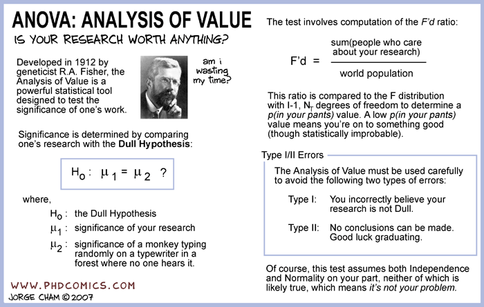

---
output:
  ioslides_presentation: default
  beamer_presentation: default
---
```{r load_pander_methods, echo=FALSE, warning=FALSE, message=FALSE}
require(pander)
replace.print.methods <- function(PKG_name = "pander") {
   PKG_methods <- as.character(methods(PKG_name))
   print_methods <- gsub(PKG_name, "print", PKG_methods)
   for(i in seq_along(PKG_methods)) {
      f <- eval(parse(text=paste(PKG_name,":::", PKG_methods[i], sep = ""))) # the new function to use for print
      assign(print_methods[i], f, ".GlobalEnv")
   }
}
replace.print.methods()
```

```{r setup, include=FALSE}
knitr::opts_hooks$set(rm.last = function(options) {
  options$code <- 
    paste0(
      options$code, 
      c(rep("", length(options$code) - options$rm.last), 
        rep(" # REMOVE", options$rm.last)
      )
    )
  options
})

builtin_source_hook <- knitr::knit_hooks$get('source')

knitr::knit_hooks$set(source = function(x, options) {
  if (!is.null(options$rm.last))  
    x <- grep("# REMOVE$", x, invert = TRUE, value = TRUE)
  if (length(x) > 0) {
    return(builtin_source_hook(x, options))
  } else {
    invisible(NULL)
  }
})
```

# Simple linear regression 

  *Regression analysis* is a *statistical* procedure for
  estimating or explaining the relationships among variables, and to utilizes these
  relations so that a response variable can be predicted from other
  variable(s). A few notional examples are

  * Predict sales of product by estimating the relationship
    between sales and amount of advertise expenses.
  * Predict size of vocabulary of a child by estimating the
    relationship between size of vocabulary, age of child and
    education level of parents.
  * Predict time of travel by estimating the relationship between
    time of travel, distance of travel, mode of travel, traffic/road
    conditions, ..., choice of music on the radio.

```{r advertising-fig, echo=FALSE, fig.cap='The Advertising dataset. The plots display sales (in thousand of units) against advertising budgets (in thousand of USD) for TV, radio and newspaper.', fig.align='center', out.width='80%'}
knitr::include_graphics("figure/advertising.pdf")
```

Suppose that we are asked to recommend a marketing plan for next
year based on this sales \& advertising data. Several questions can
then be posed

+ Is there a relationship between advertising budget and sales ?
    If there is a relationship, how strong is the relationship ?
+ Which media contributes to sales ? How strong is the contribution ?
+ How accurately can we estimate the effect of each medium on
    sales ? How accurate can we predict future sales from the effect
    of the medium on sales ?
+ Is the relationship between advertising budget and sales
    linear ? 
+ Is there synergies or interactions among the different medias as
    related to sales ?
    
## Example: Advertising dataset {#advertising}

```{r echo=-c(1:7), tidy=FALSE, cache=TRUE, fig.width=5, fig.height=5, results='asis', fig.align='center', out.width='80%'}
  library("pander")
  TV <- runif(50, min = 0, max = 300)
  Radio <- runif(50, min = 0, max = 50)
  Newspaper <- runif(50, min = 0, max = 100)
  Sales <- 2.9 + 0.046*TV + 0.189*Radio + 0.01*Newspaper + rnorm(50, sd=1.3)
  df <- data.frame(Sales, TV, Radio, Newspaper)
  knitr::kable(head(df, 6), digits=2, caption = 'Snippet of the data', booktabs = TRUE)

  g <- lm(Sales ~ TV + Radio + Newspaper, df)
  g
  
  ## Compare model with TV + Radio 
  ## and model with TV + Radio + Newspaper
  g <- lm(Sales ~ TV + Radio + Newspaper, df)
  g2 <- lm(Sales ~ TV + Radio, df)
  panderOptions('missing', '')
  anova(g2, g)

  plot(g2$fitted, Sales, xlab = "Estimated Sales", ylab = "Observed Sales")
```

## R ? Aaargh! {#r-lang}
  
> "R is a language and environment for statistical computing and graphics. It is a GNU project which is similar to the S language and environment which was developed at Bell Laboratories by John Chambers and colleagues. R can be considered as a different implementation of S. 
R provides a wide variety of statistical (linear and nonlinear modelling, classical statistical tests, time-series analysis, classification, clustering, ...) and graphical techniques, and is highly extensible. The S language is often the vehicle of choice for research in statistical methodology, and R provides an open source route to participation in that activity."
>
> --- (http://www.r-project.org)

Why use R ?

  * Free. *Libre* and *gratis*, i.e., both as in liberty
    and as in food.
  * Robust, easily extensible, flexible. It has
      + an effective data handling and storage facility
      + large, coherent and integrated collection of intermediate tools for data analysis including
        capable graphic facilities 
      + well-developed, simple and effective programming language.
  * R is easily extended through *packages*, with many package adding important/exotic features. There are     currently over $8000$ packages in the [Comprehensive R Archive Network](cran.r-project.org) and the      numbers are rapidly growing.
  * Excel does not excel and is terrible! 

Many documentations on R are available. See the \textrm{Documentation} link on [R-project](http://www.r-project.org) for a list. Following are some available R documentation.

  + [Simple R](http://www.math.csi.cuny.edu/Statistics/R/simpleR) by J. Verizani. The textbook version is     titled ``Using R for Introductory Statistics'' and is available online through the JHU library.
  + [Practical regression and ANOVA using R](cran.r-project.org/doc/contrib/Faraway-PRA.pdf) by 
    J. Faraway. The textbook version is titled ``Linear models with R''. 
  + [Computing Primer for Applied Linear Regression 4](http://users.stat.umn.edu/~sandy/alr4ed/links/alrprimer.pdf)
  + [JHU Coursera course for R](https://www.coursera.org/course/rprog)
  
## Relationships between variables

There are two type of relationships underlying regression analysis. They are (1) *functional* relationship and (2) *statistical* relationship. Suppose, for simplicity, that $Y$ and $X$ are two real-valued variables. Then functional relationships between $Y$ and $X$ are
represented as

\begin{equation*}
 Y = f(X)
\end{equation*}
for some function $f$. 

For example,
\begin{equation*}
 Y = 2X; \qquad Y = X^2; \qquad Y = \sin(2 \pi X)
\end{equation*}
are all functional relationships. Similarly, if $Y, X_1, X_2, \dots, X_m$ are real-valued variables, then 
\begin{equation*}
 Y = \sqrt{X_1^{2} + X_{2}^{2} + \cdots +
  X_m^{2}}, \qquad Y = X_1 + \frac{X_2}{2} + \frac{X_3}{3} + \cdots \frac{X_m}{m}
\end{equation*}
are functional relationships.

Functional relationships are exact. However, as regression analysis is a *statistical* procedure, using only functional relationships is cumbersome/inadequate to represent
relationships between the variables. 
  
For example, size of vocabulary of a child depends on the age of the child, education levels
of the parents. But it is highly likely that the size of the vocabulary also depends on other factors, such as school attended, personality of the child, multilingual household/neighborhood, time/place of assessment and sleeping pattern. Thus, a relationship between size of vocabulary and age of child and education levels of parents will be inexact and subjected to statistical errors.

A notional description of a statistical relationship of
the form $Y = f(X) + \color{red}{\epsilon}$
where $f(X)$ describes a functional relationship and $\color{red}{\epsilon}$ is a
statistical error, e.g., a random variable. The function $f$
describes the trend, i.e., the tendency of the changes in $Y$ as $X$
changes while $\epsilon$ describes the deviation from that trend.

```{r echo=FALSE, fig.width=5, fig.height=5, size='tiny',fig.align='center', out.width='70%'}
    library("ggplot2")
    X <- seq(from = 0, to = 2, by = 0.1)
    Y <- X^2 + rnorm(length(X), 0, sd = 0.2)
    Z <- X^2
    df <- data.frame(X,Y,Z)
    ggplot(df, aes(x = X, y = Z)) + geom_path()+
    geom_point(data = df, aes(x = X, y = Y), colour = I("red")) + xlab("X") + ylab("Y") +
    theme_bw()
```

### Regression models

A regression model is a formal description of expressing the (statistical) relationship between a set of *explanatory* or *predictor* variables and a *response* variable. There is the trend component (expressed by $f$) and a statistical component (expressed by the $\epsilon$). That is

  * There is a (conditional) probability distribution $\mathbb{P}(Y | X)$ of $Y$ for each given value of $X$.
  * The conditional mean $\mathbb{E}[Y | X]$ varies systematically with $X$.

General issues in regression model/analysis include
  
  * The number of and choice of explanatory or predictor variables.
  * Form of trend/functional relationship $f$, e.g., linear,
    piecewise linear, quadratic, polynomials.
  * Type/model for the error term/statistical deviation $\epsilon$.
  * Scope of model.
  * Causality and association in interpreting regression
    analysis. That is, regression analysis might indicate the
    presence/form of relationships between variables, but does not
    necessarily indicate a cause-and-effect relationship among the
    variables.

### The simple regression model

Consider the following model
 \begin{equation}
    Y = \beta_0 + \beta_1 X + \epsilon. (\#eq:simple)
  \end{equation} 
This a regression model with a single predictor variable $X$. The
trend relationship between $X$ and $Y$ is linear/affine. For $n$
trials, i.e., $n$ observations $(X_1, Y_1), (X_2, Y_2), \dots, (X_n,
Y_n)$ the above model correspond to

$$  Y_i = \beta_0 + \beta_1 X_i + \epsilon_i, \quad i=1,2,\dots,n.$$

The statistical deviation $\epsilon_i$ are assumed to have zero mean, variance $\sigma^2$ and are uncorrelated. That is 
$$\mathbb{E}[\epsilon_i] = 0, \quad \mathrm{Var}[\epsilon_i] = \sigma^2, \quad i=1,2,\dots,n; \quad 
\mathbb{E}[\epsilon_i \epsilon_j] = 0 \quad \text{for all $i \not = j$}.$$ 
The $\beta_0$ and $\beta_1$ are termed *regression coefficients*.

For example, consider the model $Y = 9.5 + 2X + \epsilon$ with $\epsilon$ having mean $0$ and variance $0.2$.

```{r echo=FALSE, fig.align='center', out.width='70%'}
    library("ggplot2")
    X <- seq(from = 0, to = 2, by = 0.1)
    Y <- 9.5 + 2*X + rnorm(length(X), 0, sd = 0.2)
    Z <-  9.5 + 2*X
    df <- data.frame(X,Y,Z)
    ggplot(df, aes(x = X, y = Z)) + geom_path(colour = I("red")) +
    geom_point(data = df, aes(x = X, y = Y)) + xlab("X") + ylab("Y") +
    theme_bw()
```

Some important features of the simple linear regression model are

  + The $Y_i$ are random variables.
  + $\mathbb{E}[Y_i] = \beta_0 + \beta_1 X_i$ and $\mathrm{Var}[Y_i] = \sigma^2$.
  + The responses $Y_i$ and $Y_j$ are uncorrelated whenever $i \not = j$.
  + The model can be reparameterized. For example, if $c$ is any constant, then
    \begin{equation*}
      Y_i = \beta_0 + \beta_1 X_i + \epsilon_i = (\beta_0 + c \beta_1) +
      \beta_1 (X_i - c) + \epsilon_i.
    \end{equation*}

### More general linear regression models

As an aside (and a pre-cursor of what to come later), suppose now that $X_1, X_2, \dots, X_{K}$ are predictor variables and $Y$ is a response variable. Then

  \begin{equation*}
    Y = \beta_0 + \beta_1 X_1 + \beta_2 X_2 + \cdots + \beta_K X_{K}
  \end{equation*}

  is a linear regression model. This is a general (multivariate)
  regression model. Similarly

\begin{equation*}
    Y = \beta_1 X_1 + \beta_2 X_1^{2} + \beta_{3} \tanh{X_2} +
    \beta_{4} X_3 X_{K} + \beta_{5} e^{X_4 X_5} + \beta_{6} \log{X_5} + \epsilon
  \end{equation*}

  is also a linear regression model. Similarly
 \begin{equation*}
    \log{Y} = \beta_1 X_1 + \beta_2 X_1^{2} + \beta_{3} \tanh{X_2}
    + \beta_{4} X_3 X_{K} + \beta_{5} e^{X_4 X_5} + \beta_{6} \log{X_5} + \epsilon
  \end{equation*}
is also a linear regression model. In general, if $f$ is a function
  and $g_1, g_2, \dots, g_m$ are (multivariate) functions then
 \begin{equation*}
    f(Y) = \sum_{i}\beta_i g_i(X_1, \dots, X_K) + \epsilon
  \end{equation*}

  is a linear regression model.

### Data for regression model
  
  Suppose $(X_1,Y_1), (X_2, Y_2), \dots, (X_n, Y_n)$ are given and a
  simple linear regression model $Y_i = \beta_0 + \beta_1 X_i +
  \epsilon$ is posited. A goal of regression analysis might be to
  estimate the $\beta_0$ and $\beta_1$ along with characteristics of
  $\epsilon_i$ such as its mean and variance.
  
  But before that, some distinction can be made regarding the source
  of the $(X_i,Y_i)$. The $(X_i, Y_i)$ could come from (1)
  observational data or (2) experimental data.
  
  Observational data arise from non-experimental studies and these
  studies do not control the explanatory/predictor variables of
  interest. A limitation of observation data might be that they do not
  provide adequate information to infer causal relationships among the
  predictor and response variables.
  
  Experimental data come from experimental studies and thus
  provide control over the predictor variables. If the experimental
  studies are well-designed, then it is
  possible to infer causality between predictor and response variables using
  experimental data. Well-designed experimental studies are usually
  properly randomized.
  
  As an example, the Lanarkshire milk experiment is an experiment
  carried out in 1930 in the schools of Lanarkshire that attempted to
  ascertain the effect of milk supplements on Scottish children. For
  four months, 5000 children received 3/4 pints of pasteurized milk,
  5000 children received 3/4 pints of non-pasteurized milk and 10000
  children received no milk. Each child was weighed and measured for
  height before and after the experiment. The final observations of
  the control group (the children not receiving any milk) exceeded the
  final observations of the treatment groups by average amount
  equivalent to 3 months in weight and height, thus suggesting that
  the milk supplements has detrimental effects to growth.

### Steps in regression analysis
A notional workflow when performing regression analysis is 

1. Exploratory data analysis\footnote{Explanatory data analysis (EDA) is a very important part of any model building/analysis work flow. EDA is, however, an *art*, and while there are reasonable recipes for carrying out EDA, it will not be the focus of this text.}
2. Develop tentative models
3. Evaluate candidate models
   
   + If the candidate models are appropriate proceed to identify suitable model(s) and perform inference
   + If the canddiate models are not appropriate, go back and revise/develop other tentative models.
4. Perform inference using the selected model(s). 


## Least squares estimation

> "The method of least squares is the automobile of modern statistical
analysis: despite its limitations, occasional accidents, and
incidental pollution, it and its numerous variations, extensions, and
related conveyances carry the bulk of statistical analyses, and are
known and valued by nearly all."
>
> --- Stigler (1981)

> "The method of least squares was the dominant theme --- the
   leitmotif --- of nineteenth-century statistics. In several respects
   it was to statistics what the calculus had been to mathematics a
   century earlier. 'Proofs' of the method gave direction to the
   development of statistical theory, handbooks explaining its use
   guided the application of the higher methods, and disputes on the
   priority of its discovery signaled the intellectual community's
   recognition of the method's value. Like the calculus of
   mathematics, this 'calculus of observations' did not spring into
   existence without antecedents, and the exploration of its
   subtleties and potential took over a century."
>
>  --- Stigler (1986)

Suppose $(X_1,Y_1), (X_2, Y_2), \dots, (X_n, Y_n)$ are given and a
simple linear regression model $Y_i = \beta_0 + \beta_1 X_i +
\epsilon$ is posited. One goal of regression analysis is to
estimate the $\beta_0$ and $\beta_1$ along with characteristics of
$\epsilon_i$ such as its mean and variance.

The method of least squares find estimates $\hat{\beta}_0$ and
$\hat{\beta}_1$ of $\beta_0$ and $\beta_1$, respectively, by
solving the optimization problem
\begin{equation}
  (\#eq:3)
  \min_{b_0, b_1} \sum_{i=1}^{n} (Y_i - b_0 - b_1 X_i)^2.
\end{equation}
That is, the method of least squares try to fit a line among the
sampled $(X_1,Y_1), (X_2, Y_2), \dots, (X_n, Y_n)$ such that the
total squared deviation of the $Y_i$ from the estimated $b_0 + b_1 X_i$
is minimum. 

The least square estimators $\hat{\beta}_0$ and $\hat{\beta}_1$ can
be obtained by taking the partial derivatives of $Q := \sum_{i=1}^{n}
(Y_i - b_0 - b_1 X_i)^2$ with respect to $b_0$ and $b_1$, set the
resulting expression to zero and solve for $b_0$ and
$b_1$. Specifically,
\begin{gather}
  (\#eq:LS1)
  \frac{\partial Q}{\partial b_0} = - \sum_{i} 2 (Y_i - b_0 - b_1
    X_i) \\
    (\#eq:LS2)
    \frac{\partial Q}{\partial b_1} = - \sum_{i} 2 X_i (Y_i - b_0 -
    b_1 X_i)
\end{gather}
Thus,
\begin{gather*}
  \frac{\partial Q}{\partial b_0}  = 0 \Rightarrow \sum_{i} Y_i = n
    b_0 + b_1 \sum_{i} X_i \\
    \frac{\partial Q}{\partial b_1} = 0 \Rightarrow \sum_{i} X_i Y_i =
    b_0 \sum_{i} X_i + b_1 \sum_{i} X_i^2
\end{gather*}
And so,
  \begin{gather}
  (\#eq:LS-betahat1)
    \hat{\beta}_1 = \frac{\sum_{i} (X_i - \bar{X}) (Y_i -
      \bar{Y})}{\sum_{i}(X_i - \bar{X})^2} \\
      (\#eq:LS-bethat0)
      \hat{\beta}_0 =
    \bar{Y} - \hat{\beta}_1 \bar{X}
  \end{gather}

### Gauss-Markov theorem

```{theorem, label="Gauss-Markov"}
    Under the regression model $Y_i = \beta_0 + \beta_1 X_i +
    \epsilon_i$ where $\mathbb{E}[\epsilon_i] = 0$,
    $\mathrm{Var}[\epsilon_i] = \sigma^2$ for all $i$ and
    $\mathbb{E}[\epsilon_i \epsilon_j] = 0$ for all $i \not = j$, the
    least squares estimator $\hat{\beta}_0$ and $\hat{\beta}_1$ are
    the best linear unbiased estimators (BLUE) for $\beta_0$ and
    $\beta_1$.
``` 

A few remarks regarding the Gauss-Markov theorem. 
$\hat{\beta}_0$ and $\hat{\beta}_1$ are unbiased estimator of
$\beta_0$ and $\beta_1$, i.e., $\mathbb{E}[\hat{\beta}_0] = \beta_0$
and $\mathbb{E}[\hat{\beta}_1] = \beta_1$.
$\hat{\beta}_0$ and $\hat{\beta}_1$ are linear estimators in the
sense that
\begin{gather*}
  \hat{\beta}_1 = \frac{\sum_{i} (X_i - \bar{X}) (Y_i -
    \bar{Y})}{\sum_{i}(X_i - \bar{X})^2} = \sum \frac{X_i -
    \bar{X}}{\sum (X_i - \bar{X})^2} Y_i; \quad \hat{\beta}_0 =
  \bar{Y} - \hat{\beta}_1 \bar{X}.
\end{gather*}
That is, $\hat{\beta}_0$ and $\hat{\beta}_1$ can be written as $\sum
c_i Y_i$ where each $c_i$ does not depend on the $\{Y_i\}$. $\hat{\beta}_0$ and
$\hat{\beta}_1$ are *best* estimators in that for any
unbiased linear estimator $\tilde{\beta}_0$ and $\tilde{\beta}_1$ of
$\beta_0$ and $\beta_1$, one has $\mathrm{Var}[\hat{\beta}_0] \leq
\mathrm{Var}[\tilde{\beta}_0]$, $\mathrm{Var}[\hat{\beta}_1] \leq \mathrm{Var}[\tilde{\beta}_1]$.

### Point estimator for simple linear regression model
Suppose that $\hat{\beta}_0$ and $\hat{\beta}_1$ are
estimated. Then, for any value of $X$, the regression estimate
$\hat{Y}$ for $\mathbb{E}[Y]$ is $\hat{Y} = \hat{\beta}_0 + \hat{\beta}_1 X$. By
the Gauss-Markov theorem, $\hat{Y}$ is
the best linear unbiased estimator for $\mathbb{E}[Y]$.

For the given $\{(X_i, Y_i)\}$, $\hat{Y}_i = \hat{\beta}_0 +
\hat{\beta}_1 X_i$ is termed the *fitted* value and $e_i = Y_i -
\hat{Y}_i$ is termed the *residual*. Under the simple linear
regression model, the $\epsilon_i = Y_i - \beta_0 - \beta_1 X_i$ are
uncorrelated random variables with mean $0$ and variance
$\sigma^2$. Thus, one can estimate $\sigma^2$ from the residuals
$\{e_i\}$. Namely,
\begin{equation*}
  s^2 = \frac{1}{n-2} \sum_{i=1}^{n} e_i^2
\end{equation*}
is an unbiased estimator for $\sigma^2$. The quantity $s^2$ is also
referred to as the mean squared error or MSE.

### Example: Electricity usage
```{r echo=FALSE, fig.align='center', out.width='60%'}
library("SemiPar")
data(elec.temp)
knitr::kable(head(elec.temp, 6), digits=2, caption = 'Snippet of the eletricity usage data', booktabs = TRUE)
```

The \textrm{elec.temp} data frame has 55 observations on monthly 
electricity usage in kilowatt-hours and average 
temperature for a house in Westchester County, 
New York, USA.  We now regress the $\mathrm{log}$ of *usage* as the
response variable against *temp* as the predictor variable.

```{r echo = -1, cache=TRUE, fig.width=8, fig.height = 6, fig.align='center', out.width='80%'}
options(digits=3)
library("SemiPar")
data(elec.temp)
temp <- elec.temp$temp; 
usage <- elec.temp$usage
txx <- sum((temp - mean(temp))^2)
beta1.hat <- sum((temp - mean(temp))*log(usage))/txx
beta0.hat <- mean(log(usage)) - beta1.hat*mean(temp)

plot(temp, log(usage))
curve(beta0.hat + beta1.hat*x, seq(min(temp),max(temp),by=1), add = TRUE)
```
The above computation yield $\hat{\beta}_0 = `r beta0.hat`$ and $\hat{\beta}_1 = `r beta1.hat`$. Equivalently, 
```{r echo = TRUE, cache=TRUE, fig.width=8, fig.height = 6, fig.align='center', results='asis',  out.width='80%'}
   lm(log(usage) ~ temp)
```

### Example: Midterm vs Final exam score

```{r stat500-example0, cache = FALSE, echo= FALSE, fig.align='center', out.width='80%'}
  library("faraway")
  data(stat500)
  knitr::kable(head(stat500, 6), digits=2, caption = 'Snippet of the Stat500 data', booktabs = TRUE)
```

Exam score for Statistics 500 in one year 
at the University of Michigan.  We observe a ``regression to the mean'' phenomenon.

```{r label=stat500-example2, cache = TRUE, fig.width=6, fig.height=6, fig.align='center', fig.cap="Regression to the mean; the dashed-line is the regression line, indicating that students with extremely low scores on the midterm exam improved while those with extremely high scores regressed.", out.width='80%'}
  stat500 <- data.frame(scale(stat500))
  midterm <- stat500$midterm 
  final <- stat500$final
  txx <- sum((midterm - mean(midterm))^2)
  beta1.hat <- sum((midterm - mean(midterm))*final)/txx
  beta0.hat <- mean(final) - beta1.hat*mean(midterm)
  c(beta0.hat, beta1.hat)

  plot(midterm,final); abline(0,1)
  curve(beta0.hat + beta1.hat*x, seq(min(midterm),max(midterm), by = 0.1), lty = 2, add = TRUE)
```

### Normal error regression model

The normal regression is of the form
\begin{equation}
  (\#eq:normal-error)
  Y_i = \beta_0 + \beta_1 X_i + \epsilon_i; \quad \epsilon_i
  \overset{\mathrm{i.i.d}}{\sim} \mathcal{N}(0, \sigma^2)
\end{equation}
That is, the $\epsilon_i$ are independent,
identically distributed Gaussian random variables with mean $0$ and
variance $\sigma^2$. The normal error regression model is a special case of the simple 
linear regression model discussed earlier. The assumption of normally distributed $\epsilon_i$ allows one to perform more detailed inference, e.g., confidence interval estimation for the parameters $\beta_0$ and $\beta_1$.

Given $(X_1,Y_1), (X_2, Y_2), \dots, (X_n, Y_n)$, the likelihood of
observing the $\{Y_1,Y_2, \dots, Y_n\}$ under the normal error regression
model with parameter $\beta_0, \beta_1$ and $\sigma^2$ is
\begin{equation*}
L(\beta_0, \beta_1, \sigma^2) := \prod_{i=1}^{n} \frac{1}{\sqrt{ 2
\pi \sigma^2}} \exp \Bigl( - \frac{(Y_i - \beta_0 -
\beta_1X_i)^2}{2\sigma^2} \Bigr)
\end{equation*}

The maximum likelihood estimator for $\beta_0$, $\beta_1$ and $\sigma^2$ are
then estimates that maximizes the likelihood $L(\beta_0, \beta_1,
\sigma^2)$. That is
\begin{equation*}
\hat{\beta}_0, \hat{\beta}_1, \hat{\sigma}^2 := 
\underset{\beta_0, \beta_1, \sigma^2}{\operatorname{argmax}}
\prod_{i=1}^{n} \frac{1}{\sqrt{ 2
\pi \sigma^2}} \exp \Bigl( - \frac{(Y_i - \beta_0 -
\beta_1X_i)^2}{2\sigma^2} \Bigr).
\end{equation*}
This can be done as follows. Taking the logarithm of the likelihood gives
\begin{equation*}
\begin{split}
\log{L} &= \log
\prod_{i=1}^{n} \frac{1}{\sqrt{ 2
\pi \sigma^2}} \exp \bigl( - \frac{(Y_i - \beta_0 -
\beta_1X_i)^2}{2\sigma^2} \bigr) \\ &= - \frac{n}{2} \log{ 2
\pi \sigma^2} - \sum_{i=1}^{n} \frac{(Y_i - \beta_0 -
\beta_1X_i)^2}{2\sigma^2}.
\end{split}
\end{equation*}
Then as $\log$ is a non-decreasing function
\begin{equation*}
\begin{split}
\underset{\beta_0, \beta_1, \sigma^2}{\operatorname{argmax}}
L(\beta_0, \beta_1, \sigma^2) &= 
\underset{\beta_0, \beta_1, \sigma^2}{\operatorname{argmax}}
\log{L(\beta_0, \beta_1, \sigma^2)} \\ &= \underset{\beta_0, \beta_1, \sigma^2}{\operatorname{argmin}} \frac{n}{2} \log{ 2
\pi \sigma^2} + \sum_{i=1}^{n} \frac{(Y_i - \beta_0 -
\beta_1X_i)^2}{2\sigma^2}.
\end{split}
\end{equation*}
The partial derivatives of $\log{L}$ with respect to
$\beta_0$, $\beta_1$ and $\sigma^2$ are
\begin{gather*}
\frac{\partial \log{L}}{\partial \beta_0} = \frac{1}{2\sigma^2} \sum_{i=1}^{n} 2(Y_i -
\beta_0 - \beta_1 X_i), \\
\frac{\partial \log{L}}{\partial \beta_1} = \frac{1}{2 \sigma^2}
\sum_{i=1}^{n} 2X_i(Y_i - \beta_0 - \beta_1 X_i), \\
\frac{\partial \log{L}}{\partial \sigma^2} = -\frac{n}{2 \sigma^2} +
\frac{1}{2 \sigma^4} \sum_{i=1}^{n} (Y_i - \beta_0 - \beta_1 X_i)^2.
\end{gather*}
Setting the partial derivatives to $0$ yield the system of equations
\begin{gather*}
\frac{1}{2\sigma^2} \sum_{i=1}^{n} 2(Y_i -
\beta_0 - \beta_1 X_i) = 0, \\
\frac{1}{2 \sigma^2}
\sum_{i=1}^{n} 2X_i(Y_i - \beta_0 - \beta_1 X_i)  = 0, \\
\frac{1}{2 \sigma^4} \sum_{i=1}^{n} (Y_i - \beta_0 - \beta_1
X_i)^2 = \frac{n}{2 \sigma^2}.
\end{gather*}
The first two equations (for $\beta_0$ and $\beta_1$ ) are the same
as in the least square estimation (up to scaling by $1/(2\sigma^2)$).
Thus,
\begin{gather*}
\hat{\beta}_1 = \frac{\sum_{i} (X_i - \bar{X}) (Y_i -
\bar{Y})}{\sum_{i}(X_i - \bar{X})^2}; \quad \hat{\beta}_0 =
\bar{Y} - \hat{\beta}_1 \bar{X};   \end{gather*}
We note that the least square estimator for $\beta_0$ and $\beta_1$
thus coincides with the maximum likelihood estimator in the setting
of normal error. Substituting the value of $\hat{\beta}_0$ and $\hat{\beta}_1$ into
the equation for $\sigma^2$ also yield
\begin{equation*}
\hat{\sigma}^2 =
\frac{1}{n} \sum_{i=1}^{n} (Y_i - \hat{\beta}_0 - \hat{\beta}_1
X_i)^2 = \frac{1}{n} \sum_{i=1}^{n} (Y_i - \hat{Y}_i)^2 =
\frac{n}{n-2} s^2
\end{equation*}
so the estimator $\hat{\sigma}^{2}$ differs (slightly) from the
estimator $s^2$.

On the other hand, if the error follows a Laplace
distribution with mean $\mu$ and variance $2a^2$, i.e., the
probability density function of the error is $\tfrac{1}{2a}\exp(-|x - \mu|/a)$
then the maximum
likelihood estimator for $\beta_0$ and $\beta_1$ correspond to the
following estimator
\begin{equation*}
\underset{\beta_0, \beta_1, \sigma^2}{\operatorname{argmin}} \sum_{i=1}^{n} | Y_i - \beta_0 -
\beta_1 X_i |
\end{equation*}
which has no closed-form formula.

## Normally distributed random variables

> "Everyone believes in the normal law of errors: the mathematicians, because they think it is an experimental fact; and the experimenters, because they suppose it is a theorem of mathematics."
>
> --- Gabriel Lippman

A random variable $X$ is said to have the *normal* or
*Gaussian* distribution with mean $\mu$ and variance $\sigma^2 > 0$ 
if its probability density function is
\begin{equation*}
  \frac{1}{\sqrt{2 \pi \sigma^2}} \exp\Bigl( - \frac{(x - \mu)^2}{2\sigma^2}\Bigr)
\end{equation*}
A normal random variable $X$ with mean $\mu$ and variance $\sigma^2$
will be denoted as $X \sim N(\mu, \sigma^2)$. A $X \sim N(0,1)$ is said to
be a *standard normal* random variable. For any $X \sim N(\mu,
\sigma^2)$ the random variable $\tfrac{X - \mu}{\sigma}$ is standard
normal, i.e., $\tfrac{X - \mu}{\sigma} \sim N(0,1)$.

An important property of normally distributed random variables is that a linear combination of independent normally distributed random variables is also normally distributed. 
```{proposition linear-normal}
If $X_1, X_2, \dots, X_m$ are independent normal random variables with mean
$\mu_1, \mu_2, \dots, \mu_m$ and variances $\sigma_1^2, \sigma_2^2,
\dots, \sigma_m^2$, then $c_1 X_1 + c_2 X_2 + \cdots c_m X_m$ is a
normal random variable with mean $\sum c_i \mu_i$ and variance
$\sum c_i^2 \sigma_i^2$.
```

### $\chi_{m}^{2}$ distribution
Let $X_1, X_2, \dots, X_m$ be independent $N(0,1)$ random
variables. Then $\sum X_i^{2}$ follows the
(central) *chi-squared* distribution with $m$ degree of freedom. 
The mean and variance of a $\chi^{2}_m$
random variable is $m$ and $2m$ respectively. 

Similarly, let $X_1, X_2, \dots, X_m$ be independent $N(\mu_i, 1)$ random
variables. Then $\sum X_i^{2}$ follows the *non-central* chi-squared distribution with $m$ degrees of freedom and *non-centrality* parameter $\lambda = \sum_{i} \mu_i^2$. 
The mean and variance is $m + \lambda$ and $2m +
4\lambda$, respectively. 


```{r chiplots-example, tidy = TRUE, fig.width=8,fig.height=4, fig.align='center', echo = FALSE,cache=TRUE ,out.width='80%', message=FALSE, fig.cap="Plots of probability distribution functions for the chi-squared distributions with $1,2,3,4,6$, and $9$ degrees of freedom and non-centrality parameter $0$ (left plot) and $2$ (right plot)"}
require(ggplot2)
require(gridExtra)
x1 <- seq(from = 0.1, to = 5, by = 0.1)
cbPalette <- c("#999999", "#E69F00", "#56B4E9", "#009E73", "#F0E442", "#0072B2", "#D55E00", "#CC79A7")

p <- qplot(x1, geom = "blank") + theme_bw() + xlab("") + ylab("")
dfvec <- c(1,2,3,4,6,9)
for(i in 1:length(dfvec)){
   stat <- stat_function(aes(x = x1, y = ..y..), fun = dchisq, colour=cbPalette[i], n = 100,
                     args = list(df = dfvec[i], ncp = 0))
   p <-  p + stat


}

x2 <- seq(from = 0.1, to = 10, by = 0.1)

q <- qplot(x2, geom = "blank") + theme_bw() + xlab("") + ylab("")
for(i in 1:length(dfvec)){
stat <- stat_function(aes(x = x2, y = ..y..), fun = dchisq, colour=cbPalette[i], n = 100,
                       args = list(df = dfvec[i], ncp = 2))
q <-  q + stat
}

grid.arrange(p,q, ncol = 2)
```

### Student $t$-distribution

Let $X$ and $Y$ be independent random variables with $X \sim N(0,1)$
and $Y \sim \chi^{2}_{m}$. Then the random
variable $T = \tfrac{X}{\sqrt{Y/m}}$ follows the Student
$t$-distribution with $m$ degree of freedom. Similarly, let $X$ and $Y$ be independent
random variables with $X \sim N(\mu, 1)$ and $Y \sim
\chi_{m}^{2}$. Then $T = \tfrac{X}{\sqrt{Y/m}}$ follows the
non-central t-distribution with $m$ degree of freedom
and non-centrality parameter $\mu$.

```{proposition student-t}
Let $X_1, X_2, \dots, X_n$ be independent $N(\mu, \sigma^2)$
    random variables, $n \geq 2$. Then $\bar{X} = \tfrac{1}{n} \sum X_i$ and $s^2 = \tfrac{1}{n-1} \sum (X_i - \bar{X})^2$, the sample mean and
    sample variance of the $\{X_i\}$, are independent (by Cochran's theorem). 
Furthermore, $\tfrac{(n-1)s^2}{\sigma^2} \sim \chi^{2}(n-1)$. Thus
    $\tfrac{\bar{X} - \mu}{s/\sqrt{n}}$ follows the Student
    $t$-distribution with $n-1$ degrees of freedom.
```

```{r tplots-example, tidy = TRUE, size = 'tiny', fig.width=8,fig.height=4, fig.align='center',echo = FALSE, cache=TRUE, ,out.width='80%', fig.cap="Plots of probability distribution functions for the Student $t$-distributions with degrees of freedom $1,2,5,10,20$, and $50$ and non-centrality parameter $0$ (left plot) and $2$ (right plot)."}
 require(ggplot2)
 require(gridExtra)
 x1 <- seq(from = - 5, to = 5, by = 0.1)
cbPalette <- c("#999999", "#E69F00", "#56B4E9", "#009E73", "#F0E442", "#0072B2", "#D55E00", "#CC79A7")

 p <- qplot(x1, geom = "blank") + theme_bw() + xlab("") + ylab("")
 dfvec <- c(1,2,5,10,20,50)
 for(i in 1:length(dfvec)){
 stat <- stat_function(aes(x = x1, y = ..y..), fun = dt, colour=cbPalette[i], n = 100,
                      args = list(df = dfvec[i], ncp = 0))
  p <-  p + stat


  }

  x2 <- seq(from = - 5, to = 10, by = 0.1)

  q <- qplot(x2, geom = "blank") + theme_bw() + xlab("") + ylab("")
 for(i in 1:length(dfvec)){
 stat <- stat_function(aes(x = x2, y = ..y..), fun = dt, colour=cbPalette[i], n = 100,
                      args = list(df = dfvec[i], ncp = 2))
  q <-  q + stat
  }

  grid.arrange(p,q, ncol = 2)
```

### $F$-distribution
Let $U_1$ and $U_2$ be *independent* random
variables with $U_1 \sim \chi_{m_1}^{2}$ and $U_2 \sim
\chi_{m_2}^{2}$. Then $V = \tfrac{U_1/m_1}{U_2/m_2}$ has the
(central) $F$-distribution with $m_1$ and $m_2$ degrees of freedom
and is denoted as $V \sim F_{m_1,m_2}$. Similarly, let $U_1$ and $U_2$ be
  independent random variables with $U_1 \sim \chi_{m_1}^{2}(\lambda)$
  and $U_2 \sim \chi_{m_2}^{2}$. Then $V = \tfrac{U_1/m_1}{U_2/m_2}$
  has the non-central $F$-distribution with $m_1$ and
  $m_2$ degrees of freedom and non-centrality parameter $\lambda$ and
  is denoted as $V \sim F_{m_1,m_2}(\lambda)$.

```{r Fplots-example, tidy = TRUE, size = 'tiny', fig.width=8,fig.height=4, fig.align='center',echo = FALSE, cache=TRUE, ,out.width='80%', fig.cap="Plots of probability distribution functions for the $F$-distributions with degrees of freedom $2,3,5,10,20$, and $30$ and non-centrality parameter $0$ (left plot) and $2$ (right plot)."}
require(ggplot2)
require(gridExtra)
x1 <- seq(from = 0., to = 5, by = 0.1)
cbPalette <- c("#999999", "#E69F00", "#56B4E9", "#009E73", "#F0E442", "#0072B2", "#D55E00", "#CC79A7")

p <- qplot(x1, geom = "blank") + theme_bw() + xlab("") + ylab("")
dfvec <- c(2,3,5,10,20,30)

for(i in 1:length(dfvec)){
  stat <- stat_function(aes(x = x1, y = ..y..), fun = stats::df, colour=cbPalette[i], n = 100,
                     args = list(df1 = 1, df2 = dfvec[i], ncp = 0))
 p <-  p + stat
 }

 x2 <- seq(from = 0, to = 5, by = 0.1)
  

  q <- qplot(x2, geom = "blank") + theme_bw() + xlab("") + ylab("")
  for(i in 1:length(dfvec)){
    stat <- stat_function(aes(x = x2, y = ..y..), fun = stats::df, colour=cbPalette[i], n = 100,
                    args = list(df1 = 1, df2 = dfvec[i], ncp = 2))
  q <-  q + stat
  }

  grid.arrange(p,q, ncol = 2)
```

## Hitchhiker review of hypothesis testing
```{r anova-fig, echo=FALSE, fig.cap="Piled higher and deeper", fig.align='center', out.width='80%'}

```

Let $\mathbf{X} = (X_1, X_2, \dots, X_n)$ are observed data. Then a
parametric *statistical model* $\mathcal{P}$ for $\mathbf{X}$ is a family
of distributions $P_{\theta}$ with $\theta \in \Theta \subset \mathbb{R}^{k}$ for some $k$, i.e.,
\begin{equation*}
   \mathcal{P} = \{ P_{\theta} \colon \theta \in \Theta \subset \mathbb{R}^{k} \}.
\end{equation*}
with $P_{\theta^{*}} \in \mathcal{P}$ being the distribution of $\mathbf{X}$.

Let $\Theta_0$ and $\Theta_1$ be disjoint partition of $\Theta$,
i.e., $\Theta_0 \cup \Theta_1 = \Theta$ and $\Theta_0 \cap \Theta_1
= \emptyset$. We will call $\Theta_0$ as the *null* hypothesis and
$\Theta_1$ as the *alternative* hypothesis.

The problem of hypothesis testing correspond to
the problem of asking whether $P_{\theta^{*}} \in \mathcal{P}_0 = \{
P_{\theta} \colon \theta \in \Theta_0 \}$ or that $P_{\theta^{*}} \in
\mathcal{P}_{1} = \{P_{\theta} \colon \theta \in  \Theta_1 \}$. That is
$$
    H_0 \colon \theta^{*} \in \Theta_0 \quad \text{versus} \quad H_1
    \colon \theta^{*} \in \Theta_1
$$
A hypothesis (null or alternative) is *simple* if it specifies a
single distribution, e.g., $\Theta_0$ is simple if $|\mathcal{P}_0|
= 1$, and *composite* otherwise. If $\Theta$ has an order
relation, then we can refer to "one-sided" or "two-sided" hypothesis.

For example, let $\mathbf{X}$ be a sequence of head/tail
observations when flipping a coin $100$ times. Then a possible statistical model
for $\mathbf{X}$ is $\mathcal{P} = \{ \mathrm{Binomial}(100, p)
\colon p \in (0,1) \}$ with $\Theta = (0,1)$. Consider the following
partitions of $\Theta$
\begin{gather*}
    \Theta_0 = \{0.5\}; \quad \Theta_1 = \{ \theta \not = 0.5
    \} \tag{a} \\
    \Theta_0 = \{\theta \leq 0.5 \}; \quad \Theta_1 = \{\theta > 0.5\} \tag{b}\\
    \Theta_0 = \{\theta \geq 0.5 \}; \quad \Theta_1 = \{\theta < 0.5
    \} \tag{c} \\
    \Theta_0 = \{ 0.3 \leq \theta \leq 0.7 \}; \quad \Theta_1 = \{
    \theta < 0.3 \vee \theta > 0.7 \} \tag{d}
  \end{gather*}
Then in (a), $\Theta_0$ is simple and $\Theta_1$ is
composite. (a) is also an example of a "two-sided" test. In (b),
both hypothesis are composite. (b) and (c) are examples of a "one-sided"
test. (d) is an example of a general "two-sided" test.

Another possible statistical model for $\mathbf{X}$ is $\mathcal{P}
= \{ \mathrm{Binomial}(100,p) \colon p \in \Theta \}$ with $\Theta =
\{0.3, 0.7\}$. Then $\Theta_0 = \{0.3\}$ and $\Theta_1 = \{0.7\}$
are both simple "hypothesis".

A rejection region is a subset $C$ of the observation space for which we
will reject the null hypothesis $H_0$ if our observation
$\mathbf{X}$ lies in $C$. For example, if $\mathbf{X} = \{X_1, X_2,
\dots, X_n\}$ and each of the $X_i \in \{0,1\}$ then the rejection
region is a subset of $\{0,1\}^{n}$. Similarly, if $X_i \in
\mathbb{R}$ then the rejection region is a subset of
$\mathbb{R}^{n}$.

### Q. What is power ? A. Watt is power.

Action                  $H_0$ is true   $H_0$ is false 
-----                   -------------   --------------
Reject $H_0$            Type-I error    No error
Fail to reject $H_0$    No error        Type-II error

The two-type of errors are not equivalent. The distinguishing
feature of hypothesis testing is the manner in which it addresses
the trade-off between Type-I error and Type-II error. Under the
Neyman-Pearson formulation of hypothesis testing, the null
hypothesis is given a privileged status, i.e., $H_0$ is maintained
unless there is compelling evidence against it. Under the
Neyman-Pearson formulation, the *significance* level of a test
is the upper bound on the maximum Type-I error of the test and the
*power* of a test is one minus the Type-II error of the test.


Many of the hypothesis testing problem in this course is
concerned with a "two-sided" test or a "one-sided" test with the
null hypothesis being a simple hypothesis.

A test statistic $T(\mathbf{X})$ is a random variable (a function of
the observed data) whose values are used to decide between the null
and the alternative hypothesis. Associated with a test statistic is
a partition $C_0$ and $C_1$ of $\mathbb{R}$ such that if
$T(\mathbf{X}) \in C_1$ then we "reject" $H_0$ and if
$T(\mathbf{X}) \in C_0$ then we "fail to reject"
$H_0$.

For simplicity, we often formulate the test statistic
$T(\mathbf{X})$ so that

+ $T(\mathbf{X})$ is large when rejecting $H_0 \colon \theta \leq
\theta_0$ in favor of $H_1 \colon \theta > \theta_0$, that is
$C_1 = [a, \infty)$ and $C_0 = (-\infty, a)$ for some $a$.
+ $T(\mathbf{X})$ is small when rejecting $H_0 \colon \theta \geq
\theta_0$ in favor of $H_1 \colon \theta < \theta_0$, that is $C_1
= (-\infty, a)$ and $C_0 = (a, \infty)$.
+ $T(\mathbf{X})$ is far away from $\theta_0$ when rejecting $H_0 \colon
\theta = \theta_0$ in favor of $H_1 \colon \theta \not =
\theta_0$, that is $C_1 = (-\infty, a) \cup (b, \infty)$ and $C_0
= (a,b)$.

For example, let $\mathbf{X}$ be $n$ throw of
a coin. Let $\mathcal{P} = \{ \mathrm{Binomial}(n, p) \}$ be the
statistical model and let
$T(\mathbf{X}) = \frac{\text{\# of "H" in the sequence $\mathbf{X}$}}{\text{length of
$\mathbf{X}$}}$ be the test statistic.

Then in general, $T(\mathbf{X})$ is "large"" when we reject
$H_0 \colon p \leq 0.5$ in favor of $H_1 \colon p >= 0.5$ and
$T(\mathbf{X})$ is "far away" from $0.3$ when we reject $H_0
\colon p = 0.3$ in favor of $H_1 \colon p \not = 0.3$.

The $p$-value corresponding to an observed $T(\mathbf{X}) =
t_{\mathrm{obs}}$ is then the probability (under the null-hypothesis)
that $T(\mathbf{X}')$ is "at least as extreme" as $t_{\mathrm{obs}}$ where $\mathbf{X}'$ is
an independent replication of $\mathbf{X}$. An exact definition of
$p$-values is quite tricky [@schervish-pval].

For more on $p$-values, see also the articles @mindless and @robust-mis.

## Inferences concerning $\hat{\beta}_1$
  We recall the simple linear regression model $Y_i = \beta_0 +
  \beta_1 X_i + \epsilon_i$ with the $\epsilon_i$ i.i.d Gaussian with
  mean $0$ and variance $\sigma^2$. Recall that $\hat{\beta}_1$, the
  least-square estimator (and also maximum likelihood estimator) of
  $\beta_1$ is given by
  \begin{equation*}
    \hat{\beta}_1 = \frac{\sum{(X_i - \bar{X})(Y_i -
        \bar{Y})}}{\sum_{j} {(X_j - \bar{X})^2}} = \sum{\frac{(X_i -
          \bar{X})}{\sum_{j}{(X_j - \bar{X})^2}} Y_i}
  \end{equation*}
  Then $\hat{\beta}_1$ is normally distributed with parameters
  \begin{equation*}
   \mathbb{E}[\hat{\beta}_1] = \beta_1; \qquad \mathrm{Var}[\hat{\beta}_1] = \frac{\sigma^2}{\sum{(X_i -
      \bar{X})^2}}.
  \end{equation*}
  Indeed,
  \begin{equation*}
    \begin{split}
     \mathrm{Var}[\hat{\beta}_1] &= \mathrm{Var}\Bigl[ \sum{\frac{(X_i -
          \bar{X})}{\sum_{j}{(X_j - \bar{X})^2}} Y_i}\Bigr] =
      \sum_{i}  \mathrm{Var}\Bigl[\frac{(X_i -
          \bar{X})}{\sum_{j}{(X_j - \bar{X})^2}} Y_i\Bigr]  \\ &=       \sum_{i}  \Bigl(\frac{(X_i -
          \bar{X})}{\sum_{j}{(X_j - \bar{X})^2}}\Bigr)^{2} \mathrm{Var}[Y_i]
         = \sigma^{2}
         \sum_{i} \frac{(X_i -
          \bar{X})^{2}}{(\sum_{j}{(X_j - \bar{X})^2})^2} \\ & =
          \frac{\sigma^2}{\sum{(X_i - \bar{X})^2}}
        \end{split}
  \end{equation*}
  As $\sigma^2$ is unknown, it can be replaced with its unbiased estimate $\mathrm{MSE}
  = \tfrac{1}{n-2} \sum{ (Y_i - \hat{\beta}_0 - \hat{\beta}_1 X_i)^2}
  = \tfrac{1}{n-2} \sum{ (Y_i - \hat{Y}_i)^2}$.

  We then arrived at the following expression for $s^{2}\{\hat{\beta}_1\}$, an
  *estimate* for the *variance* of the *estimator* $\hat{\beta}_1$
  \begin{equation*}
    s^{2}\{\hat{\beta}_1\} = \frac{\mathrm{MSE}}{\sum{(X_i - \bar{X})^2}}
  \end{equation*}
  One can then show that the normalized statistic $\tfrac{\hat{\beta}_1 -
    \beta_1}{s\{\hat{\beta}_1\}}$ follows a Student t-distribution with $n - 2$ degrees
  of freedom. Thus, general inference regarding confidence interval
  for $\beta_1$ can be made.
  
   For example, for a given $\alpha \in (0,1)$, the $(1 -
\alpha)\times 100\%$ confidence interval for $\beta_1$ is the interval
  \begin{equation*}
     [\hat{\beta}_1 - s\{\hat{\beta}_1\}*\mathrm{qt}(\alpha/2; n- 2), \hat{\beta}_1 + s\{\hat{\beta}_1\}*\mathrm{qt}(1 - \alpha/2; n-2)]
  \end{equation*}
  where $\mathrm{qt}(\alpha/2; n-2)$ is the $100*\alpha/2$ percentile for the
  Student $t$-distribution with $n - 2$ degrees of freedom\footnote{We
    often use the corresponding $\textbf{R}$ functions to refer to
    the quantile function of distributions}.

  Similarly, hypothesis tests of the form
  \begin{equation*}
    H_0 \colon \beta_1 = c \quad{\text{against}} \quad H_{A} \colon \beta_1
    \not = c
  \end{equation*}
  for some given $c$ at some significance level $\alpha$ can be
  resolved by computing the test statistic $\tfrac{\hat{\beta}_1 -
    c}{s\{\hat{\beta}_1\}}$ and decide, based on the rejection region $[\mathrm{qt}(\alpha/2;
  n-2), \mathrm{qt}(1 - \alpha/2; n-2)]$.

### Inferences concerning $\hat{\beta}_0$
  Recall that $\hat{\beta}_0$ is given by
  \begin{equation*}
    \hat{\beta}_0 = \bar{Y} - \hat{\beta}_1 \bar{X} =
    \sum{\frac{Y_i}{n}} -
    \bar{X} \sum_{i=1}^{n} \frac{(X_i - \bar{X}) Y_i}{t_{xx}}
  \end{equation*}
  where $t_{xx} = \sum{(X_i - \bar{X})^2}$.
  As $\mathrm{Var}[Y_i] = \mathrm{Var}[\epsilon_i] = \sigma^{2}$,
  therefore
  \begin{equation*}
    \begin{split}
    \mathrm{Var}[\hat{\beta}_0] &= \mathrm{Var}\Bigl[\sum{ \Bigl(\frac{1}{n}
      - \frac{\bar{X} (X_i - \bar{X})}{t_{xx}}\Bigr)
      Y_i}\Bigr] \\
    &= \sum_{i=1}^{n} \Bigl(\frac{1}{n} -  \frac{\bar{X}(X_i - \bar{X})}{t_{xx}}\Bigr)^2
    \mathrm{Var}[Y_i] \\
    &= \sigma^{2} \sum_{i=1}^{n} \Bigl( \frac{1}{n^2} -
    \frac{2 \bar{X}(X_i - \bar{X})}{nt_{xx}} +
    \frac{\bar{X}^{2}(X_i - \bar{X})^2}{t_{xx}^2}\Bigr) \\
    &= \sigma^{2} \Bigl( \frac{1}{n} +
    \frac{\bar{X}^{2}}{t_{xx}}\Bigr) = \sigma^{2} \Bigl(\frac{1}{n} +
    \frac{\bar{X}^{2}}{\sum{(X_i - \bar{X})^2}}\Bigr)
    \end{split}
  \end{equation*}

  Thus $\hat{\beta}_0$ is normally distributed with mean and variance
  \begin{equation*}
    \mathbb{E}[\hat{\beta}_0] = \beta_0; \quad
    \mathrm{Var}[\hat{\beta}_0] = \sigma^{2} \Bigl(\frac{1}{n} +
    \frac{\bar{X}^{2}}{\sum{(X_i - \bar{X})^2}}\Bigr)
  \end{equation*}
  Once again, using $\mathrm{MSE}$ as an estimate for $\sigma^2$, we
  have the following expression for $s^{2}\{\hat{\beta}_0\}$, the
  estimate of the variance of the estimator $\hat{\beta}_0$
  \begin{equation*}
    s^{2}\{\hat{\beta}_0\} = \mathrm{MSE} \Bigl(\frac{1}{n} +
    \frac{\bar{X}^{2}}{\sum{(X_i - \bar{X})^2}}\Bigr)
  \end{equation*}
  Then $\tfrac{\hat{\beta}_0 - \beta_0}{s\{\hat{\beta_0}\}}$ is
  distributed as a Student $t$-distribution with $n - 2$ degrees of
  freedom.

We now make a few remarks on inferences concerning $\beta_0$ and $\beta_1$

+ $\hat{\beta}_0$ and $\hat{\beta}_1$ are normally distributed under the normal error regression model for the error terms $\epsilon_i$. Non-normality of the $\epsilon_i$ will still result $\hat{\beta}_0$ and $\hat{\beta}_1$ being *approximately* 
normally distributed provided that $n$ is large enough. This is
due to the central limit theorem as $\hat{\beta}_0$ and
$\hat{\beta}_1$ are of the form $\sum{ c_i Y_i}$ where the $Y_i$
are independent and the $c_i$ does not depend on the $Y_i$, i.e.,
$\hat{\beta}_0$ and $\hat{\beta}_1$ are sums of independent random variables.
+ The confidence intervals and other inferences regarding $\beta_0$ and $\beta_1$ are to be interpreted with respect to taking repeated samples in which the $\{X_i\}$ are kept constant
between the samples. That is, the $\{Y_i\}$ might change but not the $\{X_i\}$.
+ The term $\sum{(X_i - \bar{X})^2}$ affects the variances of $\hat{\beta}_0$ and $\hat{\beta}_1$. Larger values of $\sum{(X_i - \bar{X})^2}$ lead to smaller variances.

  Assume the simple normal error linear regression model.  Let
  $\mathrm{MSE} = \frac{1}{n-2} \sum{(Y_i - \hat{\beta}_0 -
    \hat{\beta}_1 X_i)^2}$.  Then $\mathrm{MSE}$ is an unbiased
  estimate of $\sigma^2$. Let $t_{xy}$ and $t_{xx}$ be given
  by
    \begin{gather*}
      t_{xx} = \sum{(X_i - \bar{X})^2} = \sum{(X_i - \bar{X}) X_i} = \sum{X_i^2} - n \bar{X}^2;
      \\
       t_{xy} = \sum{(X_i - \bar{X})(Y_i - \bar{Y})} = \sum{(X_i -
          \bar{X})Y_i} = \sum{X_i Y_i}
        - n \bar{X} \bar{Y}
    \end{gather*}
    
Table: Parameter estimates and associated variances

parameter  |   estimate | variance | estimated variance
---------  |   -------- | -------- | -------------------
$\beta_0$  |  $\bar{Y} - \hat{\beta}_1 \bar{X}$ |  $\sigma^2(n^{-1} + \bar{X}^2/t_{xx})$ | $\mathrm{MSE} (n^{-1} + \bar{X}^2/t_{xx})$
$\beta_1$  | $t_{xy}/t_{xx}$ | $\sigma^2/t_{xx}$ | $\mathrm{MSE}/t_{xx}$

### Inference regarding $\mathbb{E}[Y_h]$
  Suppose that $\{(X_i,Y_i)\}_{i=1}^{n}$ are given following the
  normal error simple regression model and that $\hat{\beta}_0$ and
  $\hat{\beta}_1$ are estimated. Then, for a given $X_h$, the
  fitted value $\hat{Y}_h$ of $\mathbb{E}[Y_h]$ is $\hat{Y}_h = \hat{\beta}_0 +
  \hat{\beta}_1 X_h = \bar{Y} - \hat{\beta}_1 (\bar{X} - X_h)$. That
  is
  \begin{equation*}
    \hat{Y}_h = \sum_{i=1}^{n} \Bigl(\frac{1}{n} - \frac{(\bar{X} -
      X_h)(X_i - \bar{X})}{\sum{(X_i - \bar{X})^2}}\Bigr) Y_i
  \end{equation*}
  Thus, $\hat{Y}_h$ is normally distributed with
  \begin{equation*}
    \mathbb{E}[\hat{Y}_h] = \mathbb{E}[Y_h]; \quad \mathrm{Var}[\hat{Y}_h] =
    \sigma^2 \Bigl[ \frac{1}{n} + \frac{(X_h - \bar{X})^2}{\sum{(X_i - \bar{X})^2}}\Bigr]
  \end{equation*}
  and the $1 - \alpha$ confidence interval for $\mathbb{E}[Y_h]$ is
  \begin{equation*}
    \hat{Y}_h \pm \mathrm{qt}(1 - \alpha/2; n - 2) \sqrt{\mathrm{MSE}} \sqrt{\frac{1}{n} + \frac{(X_h - \bar{X})^2}{\sum{(X_i - \bar{X})^2}}}
  \end{equation*}

### Predicting $Y$ for a given $X$.
  In the previous discussion, one wants to infer the mean or expected
  value $\mathbb{E}[Y_h]$ of some $(X_h,Y_h)$ sampled point.

  Suppose instead that a new $X_{*}$ is given and one wants to infer the
  possible value of $Y_{*}$ associated with $X_{*}$. We can do that
  through the notion of a *prediction interval*. Using the fitted
  regression line, one has an estimate $\hat{Y}_{*} = \hat{\beta}_0 + \hat{\beta}_1
  X_{*}$ for the expected value $\mathbb{E}[Y_*]$ of
  $Y_*$. Furthermore, as $Y_{*} = \mathbb{E}[Y_*] + \epsilon_{*}$
  where $\epsilon_{*} \sim N(0,\sigma^2)$, the $1 - \alpha$ prediction
  interval for $Y$ is
  \begin{equation*}
    \hat{Y}_{*} \pm \mathrm{qt}(\alpha/2; n - 2) \sqrt{ \color{blue}{s^{2}\{\hat{Y_{*}}\}} \color{black}{+}
      \color{red}{s^{2}\{\epsilon\}}}
   \end{equation*}
  Substituting previous result for $s^{2}\{\hat{Y_{*}}\}$ gives the
  prediction interval
  \begin{equation*}
    \hat{\beta}_0 + \hat{\beta}_1 X_{*} \pm \mathrm{qt}(1 - \alpha/2;
    n - 2) \sqrt{\mathrm{MSE}}
      \sqrt{1 + \frac{1}{n} + \frac{(X_{*} - \bar{X})^2}{\sum{(X_i -
            \bar{X})^2}} }
  \end{equation*}


 + Variability in prediction interval depends on how far $X_*$ is from
  $\bar{X}$.
  + The construction of the prediction interval depends strongly
    on the normal error assumption. That is, departures from normality
    assumption will most likely lead to erroneous inference even when
    the number of sampled data points $\{(X_i,Y_i)\}$ is large.
  + The difference between inference regarding $\mathbb{E}[Y_h]$
    and $Y_h$ are mainly due to difference in inferring the
    *trend/mean response* in the former and the *individual outcome* in the
    latter. For example, if $X$ is GPA in high-school and $Y$
    is GPA in college, then inference regarding
    $\mathbb{E}[Y_h]$ is concerned with the average GPA of all students
    whose high school GPA is $X_h$. Meanwhile, inference regarding
    $Y_h$ is concerned with the GPA of a (specific) student whose high
    school GPA is $X_h$.
 
### Confidence band for regression line
 
  We want to obtain a, say $(1 - \alpha)\times100\%$ confidence band/region for the entire
  regression line $\mathbb{E}[Y] = \beta_0 + \beta_1 X$. This region is
  defined by the following curves
  \begin{equation*}
    \hat{\beta}_0 + \hat{\beta}_1 X \pm W_{\alpha} s\{\hat{Y}\} = \hat{\beta}_0 +
    \hat{\beta}_1 X \pm W_{\alpha} \ast \sqrt{\mathrm{MSE}} \sqrt{\frac{1}{n} + \frac{(X -
        \bar{X})^{2}}{\sum{(X_i - \bar{X})^2}}}
  \end{equation*}
  where $W_{\alpha}^2 = 2 \mathrm{qf}(1 - \alpha; 2, n - 2)$ is
  the $(1 - \alpha)\times 100\%$ quantile level of the $F$
  distribution with $\mathrm{df1} = 2, \mathrm{df2} = n - 2$.

  The above confidence band is known as the Working-Hotellling
  procedure. It is an example of simultaneous inference.
  $W$ induces a joint confidence region for the $\{\mathbb{E}[Y_h]\}$.

  A $1 - \alpha$ confidence interval derived from
  $\hat{\beta}_0$ and a $1 - \alpha$ confidence interval derived from
  $\hat{\beta}_1$ does not necessarily combine to give a joint confidence
  region of $1 - \alpha$ for $\beta_0$ and $\beta_1$.
  Similarly, a collection of $(1 - \alpha) \times
  100\%$ confidence intervals
  for $\mathbb{E}[Y_h]$ as $X_h$ varies do not necessarily combine to
  give a $(1 - \alpha) \times 100\%$ joint confidence band for the entire regression line.

### Example: synthetic dataset

The Toluca data set is a synthetic data set used in [@applied_linear_models]. The data set
describe the lot size and work hours required for a number of
manufacturing requests. We will denote these variables as $X$ (lot
size) and $Y$ (work hours). We want to perform a simple linear
regression of work hours on lot size.

```{r toluca-example1, tidy = TRUE, size = 'tiny', fig.width=8,fig.height=4, fig.align='center',echo = FALSE,cache=TRUE,out.width='80%'}
  
  df <- read.table("Rlib/data_sets/toluca.txt", col.names = c("X", "Y"))
  ggplot(df, aes(x = X, y = Y)) + geom_point() + theme_bw() + xlab("Lot Size") + ylab("Hours Worked")
```

```{r echo=FALSE}
 options(digits=2)
 n <- length(df$X)
 txx = sum((df$X - mean(df$X))^2)
 txy = sum((df$X - mean(df$X))*(df$Y - mean(df$Y)))
 beta1.hat = txy/txx
 beta0.hat = mean(df$Y) - beta1.hat*mean(df$X)
 Yhat <- beta0.hat + beta1.hat*df$X
 MSE = sum((df$Y - Yhat)^2)/(n-2)
 s2.beta0.hat <- MSE*(1/n + mean(df$X)^2/txx)
 s2.beta1.hat <- MSE/txx
``` 
 The following values are computed from the data.
 \begin{gather*}
   n = `r n`; \quad \bar{X} = `r mean(df$X)`;
   \quad \bar{Y} = `r mean(df$Y)` \\
   \quad t_{xx} = \sum_{i=1}^{n} (X_i -
   \bar{X})^2 = `r txx`; \\ \quad t_{xy} = \sum_{i=1}^{n} (X_i - \bar{X})(Y_i
   - \bar{Y}) = `r txy` \\
   \hat{\beta}_1 = \frac{t_{xy}}{t_{xx}} = `r beta1.hat`; \quad
   \hat{\beta}_0 = \bar{Y} - \hat{\beta}_1 \bar{X} = `r beta0.hat` \\
   \mathrm{MSE} = \frac{1}{n-2}\sum_{i=1}^{n}(Y_i - \hat{Y}_i)^2 =
   `r MSE` \\
   s^2\{\hat{\beta}_0\} = \mathrm{MSE}\Bigl(\frac{1}{n} +
   \frac{\bar{X}^2}{t_{xx}}\Bigr) = `r s2.beta0.hat`; \\ 
   \quad
   s^2\{\hat{\beta_1}\} = \frac{\mathrm{MSE}}{t_{xx}} = `r s2.beta1.hat`.
 \end{gather*}

```{r toluca-example4, tidy = TRUE, size = 'tiny',dependson='toluca-example3', results='asis', fig.width=8,fig.height=8, fig.align='center',echo = FALSE,cache=TRUE ,out.width='.6\\linewidth'}
 t1 <- beta1.hat/sqrt(s2.beta1.hat)
 alpha <- 0.05
```
We now want to test the hypothesis  $H_0 \colon \beta_1  = 
0$ versus $H_1 \colon \beta_1 \not =  0$. The test statistic for this is
\begin{equation*}
  T = \frac{\hat{\beta}_1}{s\{\hat{\beta}_1\}} = `r t1`
\end{equation*}
If we assume that the errors are independent and identically
distributed normal random variables, then $T$ follows a Student
$t$-distribution with `r n-2` degrees of freedom under the null
hypothesis (the hypothesis that $Y_i = \beta_0 + 0 \times X_i +
\epsilon_i$ with $\epsilon_i \sim N(0, \sigma^2)$ and independent). 
We now let $\alpha = `r alpha`$ be the significance level of the test.
As this is a
two-sided hypothesis test, the rejection region corresponding to this
level $\alpha$ is $|T| \geq \mathrm{qt}(1 - \alpha/2, `r n-2`)$, i.e.,
$|T| \geq `r qt(1 - alpha/2, df = n - 2)`$.
We thus reject the hypothesis $H_0 \colon \beta_1 = 0$ in favor of
$H_1 \colon \beta_1 \not = 0$. The $p$-value of the test is
$< 10^{-6}$. We conclude that there is strong
evidence that there is an association between lot size and work hours.

```{r toluca-example4b, tidy = TRUE, size = 'tiny',dependson='toluca-example3', results='asis', fig.width=8,fig.height=8, fig.align='center',echo = FALSE,cache=TRUE ,out.width='.6\\linewidth'}
options(digits=3)
 t2 <- (beta0.hat - 10)/sqrt(s2.beta0.hat)
 alpha <- 0.05
```
As another example, we test the hypothesis $H_0 \colon \beta_0 \leq
10$ against $H_A \colon \beta_0 > 10$. The test statistic for
this is
\begin{equation*}
 T = \frac{\hat{\beta}_0 - 10}{s\{\hat{\beta}_0\}} = `r t2` 
\end{equation*}
  If we assume that the errors are independent and identically
  distributed normal random variables, then $T$ follows a Student
  $t$-distribution with `r n-2` degrees of freedom under the null
  hypothesis (the hypothesis that $Y_i = \beta_0 + \beta_1 \times X_i +
  \epsilon_i$ with $\beta_0 \leq 10$, $\epsilon_i \sim N(0, \sigma^2)$ and independent). 
  We now let $\alpha = `r alpha`$ be the significance level of the test.
  As this is a one-sided hypothesis test, the rejection region corresponding to this
  level $\alpha$ is $T \geq \mathrm{qt}(1 - \alpha, `r n-2`)$, i.e.,
  $T \geq `r qt(1 - alpha, df = n-2)`$.
  We thus reject the hypothesis $H_0 \colon \beta_0 \leq 10$ in favor of
  $H_1 \colon \beta_0 > 10$. The $p$-value of the test is
  $`r pt(t2, n-2, lower.tail = FALSE)`$. Should we conclude that there is strong
  evidence that there is an association between positive lot size and
  doing no work hours ?
 
  ```{r toluca-example5, tidy = TRUE, size = 'tiny',dependson='toluca-example4', results='asis', fig.width=8,fig.height=8, fig.align='center',echo = FALSE,cache=TRUE ,out.width='60%'}
  CI.beta1.hat <- beta1.hat + sqrt(s2.beta1.hat)*c(qt(alpha/2, df = n - 2), qt(1 -
  alpha/2, df = n - 2))
  CI.beta0.hat <- beta0.hat + sqrt(s2.beta0.hat)*c(qt(alpha/2, df = n -
  2), qt( 1 - alpha/2, df = n -2))
  Xh <- 100
  Yh.hat <- beta0.hat + beta1.hat*Xh
  s2.Yhat <- MSE*(1/n + (Xh - mean(df$X))^2/txx)
  CI.Yh.hat <- Yh.hat + sqrt(s2.Yhat)*c(qt(alpha/2, df = n - 2), qt( 1 - alpha/2, df = n -2))
```
The $`r (1 - alpha)*100`\%$ confidence intervals for $\beta_0$
and $\beta_1$ is given by
\begin{gather*}
  `r beta0.hat` \pm `r qt(1 - alpha/2, df = n - 2)`
  \sqrt{`r s2.beta0.hat`} =   (`r CI.beta0.hat`);  \\
  `r beta1.hat` \pm `r qt(1 - alpha/2, df = n - 2)`
  \sqrt{`r s2.beta1.hat`} = (`r CI.beta1.hat`) 
\end{gather*}
respectively. The confidence interval for $\beta_1$ indicates that we
will reject the hypothesis $H_0 \colon \beta_1 \leq c$ in favor of
$H_1 \colon \beta_1 > c$ at significance level $`r alpha`$ for
any $c < `r min(CI.beta1.hat)`$.

Suppose now that $X_h = `r Xh`$. Then the estimate $\hat{Y}_h$ for $\mathbb{E}[Y_h]$ and
its estimated variability is
\begin{gather*}
  \hat{Y}_h = \hat{\beta}_0 + \hat{\beta}_1 X_h = `r Yh.hat`; \\
  s^{2}\{\hat{Y_h}\} = \mathrm{MSE}\Bigl(\frac{1}{n} + \frac{(X_h - \bar{X})^2}{t_{xx}}\Bigr) = `r s2.Yhat`
\end{gather*}
The $`r (1 - alpha)*100`\%$ confidence interval for
$\mathbb{E}[Y_h]$ is then given by
\begin{equation*}
  \hat{Y}_h \pm s\{\hat{Y}_h\} \ast t(`r 1- alpha/2`, `r n - 2`) = (`r CI.Yh.hat`)
\end{equation*}

```{r toluca-example7, tidy = TRUE, size = 'tiny',dependson='toluca-example4', results='asis', fig.width=8,fig.height=8, fig.align='center',echo = FALSE,cache=TRUE, out.width='.6\\linewidth'}
 s2.Yhat.pred <- MSE*(1 + 1/n + (Xh - mean(df$X))^2/txx)
 CI.Yh.hat.pred <- Yh.hat + sqrt(s2.Yhat.pred)*c(qt(alpha/2, df = n - 2), qt( 1 - alpha/2, df = n -2))
 ```
 
 We now compute a prediction interval for $X_{*} = 100$. From our
 previous derivations, the estimated variability for $\hat{Y_{*}}$ is
 \begin{equation*}
   s^{2}_{\mathrm{pred}}\{\hat{Y}_{*}\} = \mathrm{MSE}\sqrt{1 +
     \frac{1}{n} + \frac{(X_* - \bar{X})^2}{t_{xx}}} = `r s2.Yhat.pred`.
 \end{equation*}
 Thus the $`r (1 - alpha)*100`$ prediction interval for $Y_{*}$ is
 \begin{equation*}
   \hat{Y}_{*} \pm s_{\mathrm{pred}}\{\hat{Y}_{*}\}
   \mathrm{qt}(`r 1 - alpha/2`, `r n-2`) = (`r CI.Yh.hat.pred`)
 \end{equation*}

 ```{r toluca-example6, fig.width=8,fig.height=8, fig.cap="Least square regression line (in black) and associated confidence bands. The green curve is the 95\\% Working-Hotelling confidence band. The blue curve is the 95\\% confidence band from the confidence intervals for $\\mathbb{E}[Y_h]$ as $X_h$ varies. The red curve is the 95\\% confidence band obtained from combining the 95\\% confidence intervals for $\\beta_0$ and $\\beta_1$.", fig.align='center', echo=FALSE, cache=FALSE, out.width='60%'}
 s2.Yhat <- MSE*(1/n + (df$X - mean(df$X))^2/txx)
 upper.Yhat <- Yhat + sqrt(s2.Yhat)* qt( 1 - alpha/2, df = n -2)
 lower.Yhat <- Yhat - sqrt(s2.Yhat)* qt( 1 - alpha/2, df = n -2)

 W <- sqrt(2*qf(1 - alpha, df1 = 2, df2 = n - 2))
 upper.Yhat.WH <- Yhat + sqrt(s2.Yhat)*W
 lower.Yhat.WH <- Yhat - sqrt(s2.Yhat)*W
 TT <- qt( 1 - alpha/2, df = n -2)
 lower.Yhat.naive <- beta0.hat - sqrt(s2.beta0.hat)*TT + (beta1.hat - sqrt(s2.beta1.hat)*TT)*df$X
 upper.Yhat.naive <- beta0.hat + sqrt(s2.beta0.hat)*TT + (beta1.hat + sqrt(s2.beta1.hat)*TT)*df$X
 df.new <- data.frame(df, Yhat, upper.Yhat, lower.Yhat, upper.Yhat.WH,
 lower.Yhat.WH, upper.Yhat.naive, lower.Yhat.naive)
 ggplot(df.new, aes(x = X, y = Y)) + geom_point() + theme_bw() +
 geom_line(aes(x = X, y = upper.Yhat), color = "blue") + geom_line(aes(x = X, y =
 lower.Yhat), color = "blue") + geom_line(aes(x = X, y = Yhat),
 colour = "black") + geom_line(aes(x = X, y = upper.Yhat.WH), color = "green") + geom_line(aes(x = X, y = lower.Yhat.WH), color = "green") + geom_line(aes(x = X, y = upper.Yhat.naive), color = "red") + geom_line(aes(x = X, y = lower.Yhat.naive), color = "red")
```
 
## Sum of squares and regression analysis {#sum-square}
 
 Consider the simple regression model $Y = \beta_0 + \beta_1 X +
 \epsilon$. If we assume that $\beta_1 = 0$ then the best estimate
 $\hat{\beta}_0$ for fitting a constant $\beta_0$ to the $\{Y_i\}$
 under least square is $\hat{\beta}_0 =
 \bar{Y}$ and the squared error of using $\bar{Y}$ as an estimate for
 the $\{Y_i\}$ is
 \begin{equation*}
 \mathrm{SSTO} = \sum{(Y_i - \bar{Y})^2}.
 \end{equation*}
 If $\beta_1 \not = 0$ and we fit the "full" model, then the squared
 error of using $\hat{\beta}_0 + \hat{\beta}_1 X$ as an estimate for
 the $\{Y_i\}$ is
 \begin{equation*}
 \mathrm{SSE} = \sum{(Y_i - \hat{Y}_i)^2} = \sum{(Y_i -
 \hat{\beta}_0 - \hat{\beta}_1 X_i)^2}
 \end{equation*}
 $\mathrm{SSTO}$ is termed the *total sum of squares* while
 $\mathrm{SSE}$ is termed the *error sum of squares*. Their
 difference is termed the *regression sum of squares* and is denoted
 $\mathrm{SSR}$.

We note that
\begin{equation*}
\begin{split}
\mathrm{SSTO} &= \sum{(Y_i - \bar{Y})^2} = \sum{(Y_i - \hat{Y}_i +
\hat{Y}_i - \bar{Y}_i)^2} \\
&= \sum{(Y_i - \hat{Y}_i)^2} + {\color{blue}{2 \sum{(Y_i - \bar{Y})(Y_i -
\hat{Y}_i)}}} +\sum{(\hat{Y}_i - \bar{Y})^2} \\
&= \sum{(Y_i - \hat{Y}_i)^2} + {\color{blue}{0}} + 
\sum{(\hat{Y}_i - \bar{Y})^2} \\ &= \mathrm{SSE} + \sum{(\hat{Y}_i
- \bar{Y})^2} = \mathrm{SSE} + \mathrm{SSR}
\end{split}
\end{equation*}
  
\begin{table}
  \centering
    \begin{tabular}{|c|c|c|c|c|c|}
      \hline
      Variation & SS & $\mathrm{df}$ & MS & $F^{*}$ & p-value \\ \hline
      Regression & $\sum{(\hat{Y}_i - \bar{Y})^2}$ & $1$ &
         $\tfrac{\mathrm{SSR}}{df}$ &$\tfrac{\mathrm{MSR}}{\mathrm{MSE}}$ &
      $F(df_1;df_2) \geq F^{*}$ \\ \hline
      Error & $\sum{(Y_i - \hat{Y}_i)^2}$ & $n - 2$ & $\tfrac{\mathrm{SSE}}{df}$ & & \\ \hline
      Total & $\sum{(Y_i - \bar{Y})^2}$ & $n - 1$ & & &\\ \hline
    \end{tabular}
    \caption{ANOVA for simple linear regression}
    \label{tab:anova}
\end{table}

As $\mathrm{SSE}$ measure the squared error when fitting the model
$Y = \beta_0 + \beta_1 X + \epsilon$ while $\mathrm{SSTO}$ measure the squared
error when fitting the model $Y = \beta_0 + \epsilon$, the ratio
$\tfrac{\mathrm{SSTO}}{\mathrm{SSE}}$ is a reasonable test statistic
for the hypothesis $\mathbb{H}_0 \colon \beta_1 = 0$ versus
$\mathbb{H}_{A} \colon \beta_1 \not = 0$. Note that
$\tfrac{\mathrm{SSTO}}{\mathrm{SSE}} = 1 +
\tfrac{\mathrm{SSR}}{\mathrm{SSE}}$.

We summarize the above observation in the following proposition.
```{proposition anova}
    Under the null hypothesis of $\mathbb{H}_0 \colon \beta_1 = 0$,
    $\mathrm{SSE}/\sigma^2$ and $\mathrm{SSR}/\sigma^2$ are
    independent $\chi^2_{n-2}$ and $\chi^2_{1}$, respectively.
```
Thus, an equivalent test statistic for $\mathbb{H}_0 \colon \beta_1 = 0$ against $\mathbb{H}_1 \colon \beta_1 \not = 0$ is
\begin{equation*}
  F^{*} = \frac{\mathrm{SSR}/df_{\mathrm{SSR}}}{\mathrm{SSE}/df_{\mathrm{SSE}}} =
  \frac{\mathrm{MSR}}{\mathrm{MSE}} 
\end{equation*}
  
Under the *null hypothesis*, the above test statistic follows
$F(1, n-2)$, a $F$ distribution with degrees of freedom $1$
and $n-2$.


### $F$-test and $t$-test
Let $T$ be the test statistic for testing the hypothesis
$\mathbb{H}_0 \colon \beta_1 = 0$ versus $\mathbb{H}_{A} \colon
\beta_1 \not = 0$ using the Student $t$-distribution. Then
$T = \tfrac{\hat{\beta}_1}{s\{\hat{\beta}_1\}}.$
    
Meanwhile,
\begin{equation*}
F^{*} = \frac{\mathrm{MSR}}{\mathrm{MSE}} =
\frac{\hat{\beta}_1^{2} t_{xx}}{ \mathrm{MSE}} =
\frac{\hat{\beta}_1^{2}}{s^{2}\{\hat{\beta}_1\}} = T^2
\end{equation*}
as $s^2\{\hat{\beta}_1\} = \mathrm{MSE}/t_{xx}$. 
    
Thus testing
$\mathbb{H}_0 \colon \beta_1 = 0$ against $\mathbb{H}_{A} \colon
\beta_1 \not = 0$ using either the test statistics $F^{*}$ and $T$ give identical results.
  
In general, if $T$
is Student $t$ with $n$ degrees of freedom, then $T^2$ is $F(1,
n)$. The $F$ test will prove to be very useful when we want to test
multiple coefficients in the multivariate linear regression model. On the
other hand, one can test $\mathbb{H}_0 \colon \beta_1 \leq 0$ versus $\mathbb{H}_{A} \colon
\beta_1 \geq 0$ using $T$ but not using $F^{*}$.


```{r salinity-example0, tidy = TRUE, size = 'tiny', fig.width=6,fig.height=6, fig.align='center',echo = FALSE,cache=TRUE, ,out.width='60%'}
  library("SemiPar")
  data(salinity)
  knitr::kable(head(salinity), booktabs = TRUE, caption = "The salinity dataset records the salinity level in the Pamlico Sound (North Carolina) from 1972 to 1977. There are 28 measurements in total. A snippet of the data is provided here.")
```

```{r salinity-example1, dependson = 'salinity-example0', tidy = TRUE, size = 'tiny', fig.width=6,fig.height=6, fig.align='center',echo = -1,cache=TRUE, rm.last=2, out.width='60%'}
  options(digits=3)
  library("SemiPar")
  data(salinity)
  salinity$delta.salinity <- salinity$salinity - salinity$lagged.sal
  Y <- salinity$delta.salinity
  X <- salinity$discharge
  txx <- sum((X - mean(X))^2)
  txy <- sum((X - mean(X))*(Y - mean(Y)))
  beta1.hat <- txy/txx
  beta0.hat <- mean(Y) - beta1.hat * mean(X)
  plot(X, Y, xlab = "discharge", ylab = "changes in salinity")
  abline(beta0.hat, beta1.hat, col = "blue")

  Y.fitted <- beta0.hat + beta1.hat*X
  n <- length(Y)
  SSE <- sum((Y - Y.fitted)^2)
  SSTO <- sum((Y - mean(Y))^2)
  MSE <- SSE/(n-2)
  Fstar <- (SSTO - SSE)/SSE * (n - 2)/1 ## Fstar = (SSTO - SSE)/MSE
  s2.beta1.hat <- MSE/txx
  T <- beta1.hat/sqrt(s2.beta1.hat)
  df <- data.frame(T = T, T2 = T^2, Fval = Fstar, qf = qf(0.95,1,n-2), qt = qt(0.975, n-2)^2)
  knitr::kable(df, booktabs = TRUE, col.names = c("T", "T^2", "F", "95% qf", "97.5% qt"))
```

### General linear test approach
  The preceding approach to test the hypothesis $\mathbb{H}_{0} \colon \beta_1 = 0$
  against the hypothesis $\mathbb{H}_{A} \colon \beta_1 \not = 0$ for
  the simple linear regression model can be extended to testing more
  general hypothesis. For example, suppose we posit the model
  \begin{equation*}
   Y_i = \beta_0 + \beta_1 X^{(1)}_{i} + \beta_2 X^{(2)}_i + \cdots + \beta_{k} X^{(k)}_i + \epsilon_i
  \end{equation*}
  Let $\hat{\beta}_0, \hat{\beta}_1, \dots, \hat{\beta}_k$ be
  estimates of $\beta_0, \beta_1, \dots, \beta_k$ and consider the
  sum of squared error
  \begin{equation*}
    \mathrm{SSEF} = \sum{(Y_i - \hat{Y}_i)^2} = \sum{(Y_i -
      \hat{\beta}_0 - \hat{\beta}_1 X^{(1)}_{i} - \cdots - \hat{\beta}_k X^{(k)}_{i})^2}.
  \end{equation*}

  Let us suppose that we are interested in whether,
  for some given $S \subset \{1,2,\dots,k\}$, that $\beta_k = 0$ for
  $k \in S$. We consider the sum of squared error
  \begin{equation*}
    \mathrm{SSER} = \sum{(Y_{i} - \tilde{Y}_{i})^2} = \sum{(Y_{i} -
      \tilde{\beta}_0 - \sum_{k \in S}{\tilde{\beta}_{k} X^{(k)}_{i}})^2}.
  \end{equation*}
  where the $\tilde{\beta}_0$ and $\tilde{\beta}_k$ for $k \in S$ are
  obtained by refitting the data with respect to the reduced
  variables. 
  
  $\mathrm{SSEF}$ measures the error for the "full" model while
  $\mathrm{SSER}$ measures the error for the "reduced" model.

  The "full" model is to be preferred over the "reduced" model,
  that is, there exists $\beta_{k} \not = 0$ for some $k \in S$, if
  $\mathrm{SSEF}$ is sufficiently smaller than $\mathrm{SSER}$. One
  way to do this is to use the statistic $\mathrm{SSER} -
  \mathrm{SSEF}$ and chose the "full" model for large value of the
  statistic. However, as the "full" model is more complex, e.g.,
  $df_{F} < df_{R}$, we might also want to penalize this
  complexity. That is, we will prefer the "full" model only if
  $\mathrm{SSEF}$ is smaller than $\mathrm{SSER}$,
  even after taking into account the extra complexity $df_{R} -
  df_{F}$. This suggest the statistic
  \begin{equation*}
    F^{*} = \frac{\mathrm{SSER} - \mathrm{SSEF}}{\mathrm{SSEF}}
    \frac{df_{F}}{df_{R} - df_{F}}
  \end{equation*}
  The distribution of $F^{*}$ follows a $F$-distribution. We will
  discuss the statistic $F^{*}$ and its properties
  in more detail when we discuss inference for the general
  linear regression model. We now present an example illustrating the use of the $F^{*}$ statistic   to compare two models for modeling the changes in salinity in the Pamlico Sound. More specifically,we want to compare the model
  $$ \textrm{delta.salinity} = \beta_0 + \beta_1 \textrm{discharge} + \epsilon $$
  with a linear term in the predictor variable *discharge*
  against the model
  $$ \textrm{delta.salinity} = \beta_0 + \beta_1 \textrm{discharge} + \beta_2 \textrm{discharge}^2 + \epsilon.$$
  with a quadratic term in the variable *discharge*.
The following output indicates that the two models are possibly "different" at significance level $\alpha = 0.05$ but are "comparable" at significance level $\alpha = 0.01$.  

```{r salinity-example3, tidy = TRUE, size = 'tiny', fig.width=6,fig.height=6, fig.align='center',echo = 2:7,cache=FALSE, out.width='60%'}
  options(digits=3)
  modelR <- lm(delta.salinity ~ discharge, salinity)
  modelF <- lm(delta.salinity ~ discharge + I(discharge^2), salinity)
  Y.fittedR <- fitted.values(modelR)
  Y.fittedF <- fitted.values(modelF)
  SSE.modelR <- sum((Y - Y.fittedR)^2)
  SSE.modelF <- sum((Y - Y.fittedF)^2)
  Fstar <- (SSE.modelR - SSE.modelF)/SSE.modelF * (n - 3)/1
  df <- data.frame(SSER = SSE.modelR, SSEF = SSE.modelF, Fval = Fstar, 
                   pval = pf(Fstar, 1, n - 3, lower.tail = FALSE))
  knitr::kable(df, booktabs = TRUE, 
               col.names = c("SSE (Reduced Model)", "SSE (Full Model)", "F value", "Pr(>F)"))
```

### Descriptive measures of linear association
Let $R^2$ be the statistic $R^{2} = 1 -
  \frac{\mathrm{SSE}}{\mathrm{SSTO}}$.
  $R^2$ measure the reduction $\mathrm{SSTO} - \mathrm{SSR}$
  obtained by considering the linear term ($\beta_1$) in the
  regression compared with the total variation $\mathrm{SSTO}$. When
  $\hat{\beta}_1 \not = 0$ and
  all observations fall on the fitted regression line, then $R^{2} =
  1$. When $Y_i = \bar{Y}$ for all $i$, then $R^{2} = 0$ (indicating a
  lack of a non-trivial linear relationship). For $0 < R^{2} < 1$,
  large values suggests higher degree of linear association.

  There are several possible mis-understanding regarding $R^{2}$. The
  main one is that $R^{2}$ only compares the fit between a horizontal line and a
    posited regression line. Thus large value of $R^{2}$ only
    indicates that the posited regression line fits better then the horizontal
    line and not that the posited regression line is a good fit for the data.
    
```{r R2-fig, echo=FALSE, fig.cap="https://xkcd.com/1725/", fig.align='center', out.width='80%'}
knitr::include_graphics("figure/linear_regression.png")
```

## Correlation analysis
### Bivariate normal distribution
Let $Y_1$ and $Y_2$ be two normally distributed random variables. The pair $(Y_1, Y_2)$ is said to have the *bivariate normal* 
distribution if, for some $\mu_1, \mu_2 \in \mathbb{R}, \sigma_1^{2} \geq 0, \sigma_{2}^2 \geq 0, \rho \in
  [-1,1]$, the distribution of $(Y_1, Y_2)$ has the form
  \begin{equation}
    (\#eq:bivariate)
    \begin{split}
    f(y_1, y_2) =  \frac{1}{2 \pi \sigma_1 \sigma_2 \sqrt{1
      - \rho^2}} \exp\Bigl[ -\tfrac{1}{2(1 - \rho^2)}\Bigl(\tfrac{(y_1 -
      \mu_1)^2}{\sigma_{1}^2} & -  \tfrac{2 \rho(y_1 - \mu_1)(y_2 -
      \mu_2)}{\sigma_1 \sigma_2} + \tfrac{(y_2 - \mu_2)^2}{\sigma_2^2}\Bigr)\Bigr]
    \end{split}
  \end{equation}

For $(Y_1, Y_2)$ being bivariate normal, the random variables $Y_1$
and $Y_2$ are also normally distributed. That is to say, the marginal distribution of $Y_1$ is $\mathcal{N}(\mu_1, \sigma_1^2)$ and the marginal distribution of $Y_2$ is  $\mathcal{N}(\mu_2, \sigma_2^2)$. 

The conditional distribution of $Y_1 | Y_2$ and $Y_2 | Y_1$ are given by
\begin{gather*}
    Y_1 | Y_2 \sim N(\mu_1 - \mu_2 \rho \tfrac{\sigma_1}{\sigma_2} + 
    \rho \tfrac{\sigma_1}{\sigma_2} Y_2, \sigma_1^2(1 - \rho^2) \\
    Y_2 | Y_1 \sim N(\mu_2 - \mu_1 \rho \tfrac{\sigma_2}{\sigma_1} + \rho \tfrac{\sigma_{2}}{\sigma_{1}} Y_1, \sigma_2^2 (1 - \rho^2))
\end{gather*}

One way to derive the above expression is via the following "de-correlation" trick. Let $Z$ be the random variable
$Z = Y_1 - \rho \frac{\sigma_1}{\sigma_2} Y_2.$
We note that $\mathrm{Cov}(Z, Y_2) = 0$, which implies that $Z$ is independent of $Y_2$. We thus have
$$Y_1 | Y_2 = Z + \rho \frac{\sigma_1}{\sigma_2} Y_2 | Y_2 = Z + \rho \frac{\sigma_1}{\sigma_2} Y_2 $$
and since $Z$ is normally distributed, $Y_1 | Y_2$ is normally distributed with mean and variance
\begin{gather*}
\mathbb{E}[Y_1 | Y_2] = \mathbb{E}[Z] + \rho \frac{\sigma_1}{\sigma_2} Y_2 = \mu_1 + \rho \frac{\sigma_1}{\sigma_2}(Y_2 - \mu_2) \\ \mathrm{Var}[Y_1 | Y_2] = \mathrm{Var}[Z + \frac{\sigma_1}{\sigma_2} Y_2 | Y_2] = \mathrm{Var}[Z] = \sigma_1^2 - 2 \rho^2 \sigma_1^2 + \rho^2 \sigma_1^2 = \sigma_1^2(1 - \rho^2)
\end{gather*}
as desired. The distribution for $Y_2 | Y_1$ is derived in an identical manner.

Thus $Y_1 | Y_2$ correspond to the normal error simple linear
regression model $Y = \beta_0 + \beta_1 X + \epsilon$ with $\beta_0 = \mu_1 -
  \tfrac{\sigma_{1}}{\sigma_{2}} \rho \mu_2$, $\beta_1 =
  \tfrac{\sigma_{1}}{\sigma_{2}} \rho$ and error $\epsilon \sim N(0,
  (1 - \rho^2)\sigma_1^2)$ and similarly for $Y_2 | Y_1$. 

  Given a collection of $\{(Y^{(i)}_1, Y^{(i)}_{2})\}$ that are
  i.i.d. from some bivariate distribution $F$, a common inference
  task is to infer the correlation $\rho$ between the $(Y^{(i)}_{1})$ and
  the $(Y^{(i)}_{2})$. An estimate of $\rho$ is given by the following
  *Pearson correlation coefficient*
  \begin{equation*}
    \hat{\rho} = \frac{\sum{(Y^{(i)}_{1} - \bar{Y}_{1})(Y^{(i)}_2 -
        \bar{Y}_2)}}{\sqrt{\bigl(\sum{(Y^{(i)}_{1} - \bar{Y}_{1})^2\bigr)}\bigl(\sum{(Y^{(i)}_2 -
        \bar{Y}_2)^2}\bigr)}}
  \end{equation*}

  It can be shown that if the distribution $F$ of the pair 
   $(Y_{1}, Y_2)$
  is bivariate normal with $\rho = 0$, i.e., $Y_1$ and $Y_2$ are
  independent normally distributed random variables, then
  $\hat{\rho}\sqrt{n-2}/\sqrt{1 - \hat{\rho}^2}$ follows the
  Student $t$-distribution with $df = n - 2$. See Section
    16.28 of @stuart-ord.

  On the other hand, if the distribution of the pair $(Y_{1}, Y_2)$
  is bivariate normal with $\rho \not = 0$, then the distribution of
  $\hat{\rho}$ is sufficiently complex. For large $n$, the central limit theorem yield the following large sample approximation for $\hat{\rho} - \rho$.
  
```{proposition sample-correlation}
If $\hat{\rho}$ is the sample correlation coefficient of a sample
  of $n$ pairs $\{(Y_{1}^{(i)}, Y_{2}^{(i)})\}$ from a bivariate normal
    distribution with correlation coefficient $\rho$, then
    $$ \sqrt{n}(\hat{\rho} - \rho) \longrightarrow N(0, (1 - \rho^2)^2)$$
as $n \rightarrow \infty$.
```

As the large-sample variance of $\sqrt{n}(\hat{\rho} - \rho)$ depends on the true parameter $\rho$, Sir Ronald
A. Fisher suggested the following transformation of $\hat{\rho}$
  \begin{equation*}
\hat{\zeta} = \tfrac{1}{2}
  \log\Bigl(\frac{1 + \hat{\rho}}{1 - \hat{\rho}}\Bigr).
  \end{equation*}
This is motivated by the fact that, in general, for any
(differentiable) transformation $f$ of
$\hat{\rho}$, the delta-method (equivalently, Taylor's theorem) yield
\begin{equation*}
  \sqrt{n}(f(\hat{\rho}) - f(\rho)) \longrightarrow N(0,
  (f'(\rho))^2( 1- \rho^2)^2)
\end{equation*}
Letting $f'(\rho)(1 - \rho^2) = 1$ we have
  \begin{equation*}
    f'(\rho) = \frac{1}{1 - \rho^2} = \frac{1}{2} \Bigl(\frac{1}{1
      + \rho} + \frac{1}{1 - \rho}\Bigr)
  \end{equation*}
  and so
  \begin{equation*}
   f(\rho) = \int \frac{1}{2} \Bigl(\frac{1}{1
      + \rho} + \frac{1}{1 - \rho}\Bigr) \mathrm{d} \rho = \tfrac{1}{2}
  \log\Bigl(\frac{1 + \rho}{1 - \rho}\Bigr)
  \end{equation*}
  which gives the transformation $\hat{\rho} \mapsto \hat{\zeta}$
  defined above. The transformation $\hat{\rho} \mapsto \hat{\zeta}$
  is viewed as a variance stabilizing transformation.

  Thus, for large $n$, we have $\sqrt{n}(\hat{\zeta} - \zeta) \sim
  N(0,1)$ (contrast this with $\sqrt{n}(\hat{\rho} - \rho) \sim N(0, (1 -
  \rho^2)^2)$). This allows us to do simple hypothesis testing and
  interval estimation for $\rho$. As an example, for a given $\alpha
  \in [0,1]$, the $100\% \times (1 - \alpha)$ confidence interval for
  $\zeta$ is
  \begin{equation*}
    \hat{\zeta} \pm \frac{1}{\sqrt{n}} \ast \mathrm{qnorm}(1 - \alpha/2)
  \end{equation*}
  where $\mathrm{qnorm}$ is the quantile function for the standard normal
  distribution. This implies the $100\% \times (1 - \alpha)$
  confidence interval
  \begin{equation*}
    [\tanh(\hat{\zeta} - \frac{1}{\sqrt{n}} \mathrm{qnorm}(1 -
    \alpha/2)), \tanh(\hat{\zeta} + \frac{1}{\sqrt{n}} \mathrm{qnorm}(1 - \alpha/2))]
  \end{equation*}
  where $\tanh(x) = \tfrac{e^{2x} - 1}{e^{2x} + 1}$ is the inverse map
  of $\tfrac{1}{2} \log{\tfrac{1 + x}{1 - x}}$.
  
### Examples

```{r fisher-example-1, tidy = TRUE, cache=TRUE,size = 'tiny', fig.width=8, fig.height=6, fig.align='center', echo = TRUE,out.width='60%'}
  
  nmc <- 10000 
  n <- 100
  r <- numeric(nmc)
  for(i in 1:nmc){
    X <- rnorm(n, mean = 0, sd = 1)
    Y <- 0.5*X + rnorm(n, mean = 0, sd = 1)
    r[i] <- cor(X,Y)
  }
  par(mfrow = c(1,2))
  hist(r, freq = FALSE, main = "Sample correlation")
  hist(0.5*log((1+r)/(1 - r)), freq = FALSE, main = "zeta-transformed sample correlation")
```

```{r brother-sister-example, tidy = TRUE, cache=TRUE,size = 'tiny', fig.width=8, fig.height=6, fig.align='center', echo = TRUE,out.width='60%'}
  ## The following data set are the heights of siblings 
  ## (brothers & sisters) from a study in 1902 by 
  ## K. Pearson and A. Lee. This data set appears as data set 373 
  ## in "A Handbook of Small Data Sets" by D. J. Hand et al.

  brother = c(71,68,66,67,70,71,70,73,72,65,66)
  sister = c(69,64,65,63, 65, 62, 65, 64, 66, 59, 62)
  plot(brother,sister)
  (rho <- cor(brother, sister))
  (zeta <- 0.5*log((1 + rho)/(1 - rho)))
  n <- length(sister)
  (rho.CI <- tanh(zeta + c(-qnorm(0.975),qnorm(0.975))*sqrt(1/(n))))
```

### Sample Correlation and Aggregation
```{r aggregation-example0, tidy=TRUE, cache=TRUE, results='asis'}
    n <- 1000
    X <- rnorm(n, sd = 1)
    Y <- 0.5 + 0.3*X + rnorm(n, mean = 0, sd = 1)
    coefficients(lm(Y ~ X)) ## This give us the estimate beta1.hat
    cor(X, Y)
```

```{r aggregation-example1, tidy=TRUE, cache=FALSE, echo=TRUE,fig.width=8, fig.heigth=6, size='tiny', results='asis', fig.align='center', out.width='60%'}
    K <- 10
    X.expand <- rep(X, each = K)
    Y <- 0.5 + 0.3*X.expand + rnorm(n*K, mean = 0, sd = 1)
    Z <- matrix(Y, nrow = n, byrow = TRUE)
    Z <- rowMeans(Z)
    coefficients(lm(Z ~ X)) 
    cor(X, Z)
```

```{r aggregation-example2, tidy=TRUE, cache=FALSE, echo = TRUE,fig.width=8, fig.heigth=6, size='tiny', results='asis', fig.align='center', out.width='50%'}
    K <- 50
    X.expand <- rep(X, each = K)
    Y <- 0.5 + 0.3*X.expand + rnorm(n*K, mean = 0, sd = 1)
    Z <- matrix(Y, nrow = n, byrow = TRUE)
    Z <- rowMeans(Z)
    coefficients(lm(Z ~ X)) 
    cor(X, Z)
```

```{r aggregation-example3, tidy=TRUE, cache=FALSE, echo = TRUE,fig.width=8, fig.heigth=6, size='tiny', results='asis', fig.align='center', out.width='50%'}
    K <- 2000
    X.expand <- rep(X, each = K)
    Y <- 0.5 + 0.3*X.expand + rnorm(n*K, mean = 0, sd = 1)
    Z <- matrix(Y, nrow = n, byrow = TRUE)
    Z <- rowMeans(Z)
    coefficients(lm(Z ~ X))
    cor(X, Z)
```
    
> The misuse of correlations derived from aggregated data to 
  represent the correlation for individuals is sometimes 
  known as the `fallacy of ecological correlation'
> 
> ``Kendall's Advanced Theory of Statistics'', Volume 1.
 
### Pearson's correlation and linearity
```{r linearity-example1, dependson = 'aggegation-example2', tidy=TRUE, cache=FALSE, echo = TRUE,fig.width=8, fig.heigth=6, size='tiny', fig.align='center', out.width='50%'}
    n <- 100
    X <- rnorm(n, mean = 0, sd = 1)
    Y <- 0.5 + 0.4*X + rnorm(n, mean = 0, sd = 1)
    Z <- X^2 + rnorm(n, mean = 0, sd = 0.5)
    cor(X, Y)
    cor(X, Z)
```
  Pearson's product-moment correlation $\rho$ is only a measure of    n   linearity association.  In addition, inferences on $\rho$ usually
  assume that the pair $(Y_1, Y_2)$ is distributed bivariate normal.

  Other notions of correlation/association coefficients can also be
  defined. Another correlation coefficient is the
  *Spearman rank correlation coefficient* $r_S$. 
  $r_S$ is an example of a
  nonparametric statistic in the sense that it does not assume the
  population from which the data is sampled has any characteristic
  structure. For a collection of $\{(Y^{(i)}_1, Y^{(i)}_{2})\}$
  sampled from a general bivariate distribution $F$, let
  $\{R^{(i)}_1\}$ and $\{R^{(i)}_{2}\}$ be the ranks of the
  $\{Y^{(i)}_{1}\}$ and $\{Y^{(i)}_{2}\}$, respectively.

  The Spearman rank
  correlation coefficient is defined as
  \begin{equation*}
    r_{S} = \frac{\sum{(R^{(i)}_{1} - \bar{R}_1)(R^{(i)}_{2} -
        \bar{R}_2)}}{\sqrt{(\sum{(R^{(i)}_1 - \bar{R}_1)^2}) (\sum{(R^{(i)}_2 - \bar{R}_2)^2})}}
  \end{equation*}
  where $\bar{R}_1 = \bar{R}_2 = (n+1)/2$ are the average of the ranks of $R^{(i)}_1$ and $R^{(i)}_2$. 

```{r spearman-example, tidy = TRUE, cache=TRUE, results='asis', size = 'tiny'}
    X[1:95] <- rnorm(95)
    X[96:100] <- rnorm(5, mean = 10, sd = 1)
    Y[1:95] <- 0.5 + 0.5*X[1:95] + rnorm(95, sd = 1)
    Y[96:100] <- 0.5 + 0.5*X[96:100] + rnorm(5, sd = 4)
    cor(X, Y) ## Pearson's correlation
    RX <- rank(X) ## Rank of the elements in X
    RY <- rank(Y)
    cor(RX, RY) ## Spearman's correlation 
```

We see that the Spearman rank correlation suffers less from "outliers". 

  We note that $-1 \leq r_S \leq 1$. The Spearman rank
  correlation coefficient measure the *monotonic association*
  between the $\{Y^{(i)}_{1}\}$ and the $\{Y^{(i)}_{2}\}$, e.g., 
  $Y^{(i)}_1 > Y^{(j)}_1$ is
  usually associated with $Y^{(i)}_2 > Y^{(j)}_2$ for any $i,j$
  pair if $r_s \approx 1$, and $Y^{(i)}_1 > Y^{(j)}_1$ is
  usually associated with $Y^{(i)}_2 < Y^{(j)}_2$ if $r_s \approx -
  1$.

  We can perform hypothesis testing of monotone association,
  by using the fact that the test statistic $\tfrac{r_{S} \sqrt{n - 2}}{1 -
    r_{S}^2}$ follows approximately the Student $t$-distribution with
  $n - 2$ degree of freedom under the null hypothesis (the null
  hypothesis being that ``there is no monotonic association''). 
